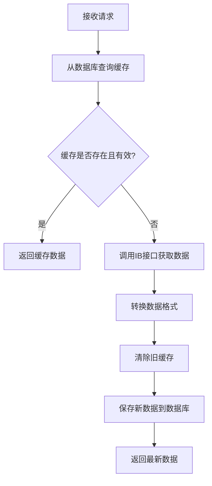

# IB历史数据接口实现方案

## 一、接口概述

### 1.1 接口功能
实现股票历史市场数据查询功能，支持从数据库缓存优先查询，如果缓存不存在或过期则从IB接口获取最新数据并同步到本地数据库。

### 1.2 接口地址
```
GET /ib/market/history/{conid}?timeRange={timeRange}
```

### 1.3 请求参数
| 参数名 | 类型 | 必选 | 说明 | 示例值 |
|--------|------|------|------|--------|
| conid | String | 是 | 合约ID | "265598" |
| timeRange | String | 否 | 时间范围，默认1m | "1d", "1w", "1m", "3m", "6m", "1y", "ytd", "max" |

### 1.4 响应格式
```json
{
  "code": 200,
  "message": "success",
  "data": {
    "dates": ["2024-01-01", "2024-01-02", ...],
    "prices": [150.25, 151.30, ...],
    "volumes": [1000000, 1200000, ...],
    "count": 100
  }
}
```

## 二、数据表设计

### 2.1 表结构
```sql
CREATE TABLE `ib_market_history_data` (
  `id` bigint NOT NULL AUTO_INCREMENT COMMENT '主键ID',
  `conid` varchar(50) NOT NULL COMMENT '合约ID',
  `symbol` varchar(20) DEFAULT NULL COMMENT '股票代码',
  `contract_desc` varchar(200) DEFAULT NULL COMMENT '股票全称',
  `time_range` varchar(10) NOT NULL COMMENT '时间范围标识 (1d, 1w, 1m, 3m, 6m, 1y, ytd, max)',
  `bar_size` varchar(10) DEFAULT NULL COMMENT 'K线粒度 (1min, 1h, 1d, 1w)',
  `open_price` decimal(15,4) DEFAULT NULL COMMENT '开盘价',
  `close_price` decimal(15,4) DEFAULT NULL COMMENT '收盘价',
  `high_price` decimal(15,4) DEFAULT NULL COMMENT '最高价',
  `low_price` decimal(15,4) DEFAULT NULL COMMENT '最低价',
  `volume` decimal(20,2) DEFAULT NULL COMMENT '成交量',
  `bar_timestamp` bigint DEFAULT NULL COMMENT 'K线时间戳（Unix时间戳）',
  `bar_date_time` datetime DEFAULT NULL COMMENT 'K线对应的日期时间',
  `data_source` varchar(20) DEFAULT 'API' COMMENT '数据来源 (API/MANUAL)',
  `create_time` datetime DEFAULT CURRENT_TIMESTAMP COMMENT '创建时间',
  `update_time` datetime DEFAULT CURRENT_TIMESTAMP ON UPDATE CURRENT_TIMESTAMP COMMENT '更新时间',
  -- 主键定义
  PRIMARY KEY (`id`),
  -- 唯一索引：防止重复数据（合约ID + 时间范围 + 时间戳）
  UNIQUE KEY `uk_conid_timerange_timestamp` (`conid`, `time_range`, `bar_timestamp`),
  -- 复合索引：优化主要查询条件（合约ID + 时间范围）
  KEY `idx_conid_timerange` (`conid`, `time_range`),
  -- 复合索引：包含更新时间，用于缓存判断
  KEY `idx_conid_timerange_updated` (`conid`, `time_range`, `update_time`),
  -- 股票代码索引：方便按代码查询
  KEY `idx_symbol` (`symbol`),
  -- 时间相关索引：优化时间范围查询和排序
  KEY `idx_bar_datetime` (`bar_date_time`),
  KEY `idx_bar_timestamp` (`bar_timestamp`),
  -- 数据管理索引
  KEY `idx_create_time` (`create_time`),
  KEY `idx_update_time` (`update_time`),
  KEY `idx_data_source` (`data_source`),
  -- 覆盖索引：包含常用查询字段，减少回表操作
  KEY `idx_covering_query` (`conid`, `time_range`, `bar_timestamp`, `close_price`, `volume`)
) ENGINE=InnoDB DEFAULT CHARSET=utf8mb4 COLLATE=utf8mb4_unicode_ci COMMENT='IB历史市场数据表';
```

### 2.2 索引设计详解
1. **主键索引**：`PRIMARY KEY (id)` - 自增主键，保证记录唯一性
2. **唯一索引**：`uk_conid_timerange_timestamp` - 防止同一合约同一时间范围的重复数据
3. **主要查询索引**：`idx_conid_timerange` - 优化最常用的查询模式
4. **缓存判断索引**：`idx_conid_timerange_updated` - 包含更新时间，优化缓存有效性判断
5. **股票代码索引**：`idx_symbol` - 支持按股票代码快速查询
6. **时间索引**：`idx_bar_datetime`, `idx_bar_timestamp` - 优化时间范围查询和排序
7. **数据管理索引**：`idx_create_time`, `idx_update_time`, `idx_data_source` - 支持数据维护操作
8. **覆盖索引**：`idx_covering_query` - 包含常用查询字段，减少回表操作

### 2.3 字段说明
- `conid`: IB系统的合约唯一标识符
- `time_range`: 前端传入的时间范围参数，用于缓存策略
- `bar_size`: IB接口的K线粒度参数，根据time_range自动转换
- `bar_timestamp`: Unix时间戳，用于精确排序
- `bar_date_time`: 便于阅读的日期时间格式

### 2.4 查询优化设计
- **主查询模式**：`WHERE conid = ? AND time_range = ? ORDER BY bar_timestamp`
- **缓存判断**：`WHERE conid = ? AND time_range = ? ORDER BY update_time DESC LIMIT 1`
- **数据清理**：`WHERE create_time < ?`
- **时间范围查询**：`WHERE bar_date_time BETWEEN ? AND ?`

## 三、架构设计

### 3.1 技术栈
- **框架**: Spring Boot + MyBatis Plus
- **数据库**: MySQL 8.0
- **缓存策略**: 基于数据库的智能缓存
- **接口调用**: RestTemplate

### 3.2 核心组件

#### 3.2.1 实体类
- `IBMarketHistoryData`: 历史数据实体，映射数据库表

#### 3.2.2 数据访问层
- `IBMarketHistoryDataMapper`: MyBatis Plus Mapper接口
- `IBMarketHistoryDataMapper.xml`: SQL映射文件

#### 3.2.3 业务逻辑层
- `IBMarketHistoryService`: 核心业务逻辑
- `IBClientPortalApiClient`: IB接口客户端

#### 3.2.4 控制层
- `IBController`: REST接口控制器

## 四、业务逻辑流程

### 4.1 数据获取流程


### 4.2 缓存策略
不同时间范围采用不同的缓存时间：
- `1d`: 15分钟缓存
- `1w`: 1小时缓存
- `1m`: 2小时缓存
- `3m`: 4小时缓存
- `6m`: 8小时缓存
- `1y`: 1天缓存
- `ytd`: 1天缓存
- `max`: 2天缓存

### 4.3 参数转换
前端timeRange到IB API参数的映射：

| timeRange | IB period | IB bar | 说明 |
|-----------|-----------|--------|------|
| 1d | 1d | 1h | 1天用1小时K线 |
| 1w | 1w | 4h | 1周用4小时K线 |
| 1m | 1m | 1d | 1月用日K线 |
| 3m | 3m | 1d | 3月用日K线 |
| 6m | 6m | 1d | 6月用日K线 |
| 1y | 1y | 1w | 1年用周K线 |
| ytd | 1y | 1d | 今年至今用日K线 |
| max | 5y | 1w | 最大范围用周K线 |

## 五、关键代码实现

### 5.1 Service核心方法
```java
public Map<String, Object> getHistoricalData(String conid, String timeRange) {
    // 1. 数据库查询
    List<IBMarketHistoryData> dbData = queryFromDatabase(conid, timeRange);
    
    // 2. 判断是否需要更新
    boolean needUpdate = shouldUpdateData(dbData, timeRange);
    
    // 3. 根据需要获取最新数据
    List<IBMarketHistoryData> finalData = needUpdate ? 
        fetchFromIBAndSync(conid, timeRange) : dbData;
    
    // 4. 转换为前端格式
    return convertToChartData(finalData);
}
```

### 5.2 IB接口调用
```java
public HistoricalMarketDataResponse getHistoricalMarketData(String conid, String timeRange) {
    String period = convertTimeRangeToPeriod(timeRange);
    String bar = convertTimeRangeToBar(timeRange);
    return getHistoricalMarketData(conid, period, bar, "SMART", true);
}
```

## 六、性能优化

### 6.1 数据库优化
1. **索引优化**: 为常用查询条件创建复合索引
2. **批量操作**: 使用批量插入减少数据库交互
3. **数据清理**: 定期清理过期数据，避免表过大

### 6.2 缓存优化
1. **智能缓存**: 根据数据特性设置不同的缓存时间
2. **增量更新**: 只更新需要的数据，避免全量刷新
3. **异步处理**: 数据同步操作使用事务保证一致性

## 七、监控与维护

### 7.1 日志记录
- 接口调用日志
- 数据同步日志
- 错误异常日志
- 性能监控日志

### 7.2 定时任务
```java
@Scheduled(cron = "0 0 2 * * ?") // 每天凌晨2点执行
public void cleanExpiredData() {
    marketHistoryService.cleanExpiredData();
}
```

### 7.3 监控指标
- 接口响应时间
- 数据库命中率
- IB接口调用频率
- 存储空间使用率

## 八、安全与异常处理

### 8.1 参数校验
- conid格式验证
- timeRange枚举值校验
- 防止SQL注入

### 8.2 异常处理
- IB接口调用失败处理
- 数据库连接异常处理
- 数据格式转换异常处理
- 统一异常响应格式

### 8.3 限流保护
- 遵循IB API调用频率限制
- 实施接口调用频率控制
- 避免过于频繁的数据刷新

## 九、测试方案

### 9.1 单元测试
- Service层业务逻辑测试
- Mapper层数据访问测试
- 工具类方法测试

### 9.2 集成测试
- Controller接口测试
- 数据库事务测试
- IB接口调用测试

### 9.3 性能测试
- 并发访问测试
- 大数据量查询测试
- 缓存命中率测试

## 十、部署说明

### 10.1 数据库准备
1. 执行DDL脚本创建表
2. 创建必要的索引
3. 配置数据库连接参数

### 10.2 配置参数
```yaml
ib:
  api:
    gateway:
      url: https://localhost:5000
  accountId: U12345678
```

### 10.3 启动验证
1. 检查数据库连接
2. 验证IB Gateway连接
3. 测试接口访问
4. 确认日志输出正常 