# 判断推理系统理论课

## 一、考点体系

1. 图形推理
2. 定义判断
3. 类比推理
4. 逻辑判断

## 二、题型特点

1. 知识点多，需全面系统学习
2. 题量较大，需确保高正确率（目标90%+）
3. 技巧灵活，需培养高效思维

## 逻辑判断

### 【题型认知】
每道题给出一段陈述，这段陈述被假设是正确的，不容置疑的。要求你根据这段陈述，选择一个参考答案。

注意：正确的参考答案应与所给的陈述相符合，不需要任何附加说明即可从陈述中直接推出。

### 【题型特征】
1. 题干：有明显“逻辑词”
2. 提问：选对/错/不确定，如“如果A，那么B”“只有C，才A”“据此可以推出”

### 考点1：假言命题（条件关系命题）
#### 一、充分条件
1. **定义**：A成立，B就成立（有A就有B）——A是B的充分条件
    - 示例：“孩子哭，就喂奶”，可表示为 $ A \to B $（A：孩子哭；B：喂奶）
2. **推理口诀**：充分条件前推后（前是后充分）

    - 示例：“有选举权，必须满18岁”，可表示为“有选举权→满18岁”
3. **逻辑词**：
    1. $ 如果A，那么B \implies A \to B $
    2. $ 只要A，就B \implies A \to B $
    3. $ 如果A，就B \implies A \to B $
    4. $ A就B \implies A \to B $
    5. $ A则B \implies A \to B $
    6. $ A必须B \implies A \to B $
    7. $ A离不开B \implies A \to B $
    8. $ 为了A，要B \implies A \to B $
    9. $ 所有A都B \implies A \to B $
    10. $ 凡是A都B \implies A \to B $

##### 【练习】画箭头

1. 如果坚持一下，那么梦想会实现

2. 如果没有阳光的照耀和雨露的滋润，那么花儿也不会开的那样鲜艳

3. 只要付出努力，就会有收获

4. 穷则独善其身

5. 建设现代化经济体系，必须坚持质量第一、效益优先

6. 为了实现梦想，要坚持到底

7. 所有诋毁袁隆平院士的人都应该受到惩罚

8. 凡是毛主席作出的决策，我们都坚决维护

9. 不到长城非好汉

#### 二、必要条件
1. **定义**：A是B成立必不可少的条件/没有A就没有B——A是B的必要条件。
    - 示例：“只有听课，才能上岸”，可表示为 $ \text{上岸} \to \text{听课} $
2. **推理口诀**：必要条件后推前（前是后必要；箭头后是必要）
3. **逻辑词**：
    1. $ 只有A，才B \implies B \to A $
    2. $ A，才B \implies B \to A $
    3. $ 除非A，才B \implies B \to A $
    4. $ A是B的前提/基础/先决条件/必然要求 \implies B \to A $
    5. $ 没有A就没有B \implies B \to A $
    6. $ 除非A，否则B \implies \neg B \to A $

##### 【练习】画箭头

1. 只有社会主义才能救中国，只有改革开放才能发展中国

2. 没有共产党，就没有新中国

3. 稳定是发展的前提

4. 除非八抬大轿，我才嫁给你

5. 除非努力，否则失败
1. **逆否等值**：$ A \to B \iff \neg B \to \neg A $

    - 示例：$无风 \to 不起浪 \iff 起浪 \to 有风$
2. **传递规则**：
   $$
   \left.
   \begin{aligned}
   A &\to B \\
   B &\to C
   \end{aligned}
   \right\} \implies A \to C \to \neg C \to \neg A
   $$
3. **箭头推导规则**：

   若 $ \text{听课} \to \text{上岸} $（等价于 $ \neg \text{上岸} \to \neg \text{听课} $）：
    - A. 小于听课，∴上岸了（**肯前必肯后**，√）
    - B. 小着没听课，∴不上岸？（**否前后不定**，×）
    - C. 小华2018年没上岸，∴不听（**否后必否前**，√）
    - D. 小亲上岸了，∴听课？（**肯后前不定**，×）
4. **二难推理**：

   （1）$ \left.
   \begin{aligned}
   A &\to B \\
   \neg A &\to B
   \end{aligned}
   \right\} \implies B $

   （2）$ \left.
   \begin{aligned}
   A &\to B \\
   A &\to \neg B
   \end{aligned}
   \right\} \implies \neg A $

#### 题目及选项

##### 【例1】

如果某人是杀人犯，那么案发时他在现场。

据此我们可以推知（）

A.张三案发时在现场，所以张三是杀人犯

B.李四不是杀人犯，所以李四案发时不在现场

C.王五案发时不在现场，所以王五不是杀人犯

D.徐六不在案发现场，所以徐六是杀人犯

##### 【例2】

山无陵，天地合，乃敢与君绝。

如果为真，那么以下选项也一定为真的是：

A.无陵，天地合，就一定与君绝

B.与君绝，则说明一定山有陵，天地分

C.有陵，天地分，就一定不与君绝

D.君绝，则一定是山有陵，天地分

##### 【例3】

有人对“不到长城非好汉”这句名言的理解是：“如果不到长城，就不是好汉。”

假定这种理解为真，则下列哪项判断必然为真？（）

A. 到了长城的人就一定是好汉

B. 如果是好汉，他一定到过长城

C. 只有好汉，才到过长城

D. 不到长城，也会是好汉

##### 【例4】

如果苇花飘飘，林溪就去观苇；如果温度很低，林溪就不去观苇；只有天空晴朗，林溪才去观苇。

现在林溪去观苇了，可见（）。

A.苇花飘飘

B.温度很高

C.风大

D.天空晴朗

##### 【例5】

只有坚持科学发展观，才能实现可持续发展。为了子孙后代，我们必须实现可持续发展。

由此可见：

A．我们必须加大宣传，重视环境保护

B．实现可持续发展必须和科学管理相结合

C．为了子孙后代，我们必须坚持科学发展观

D．只要坚持科学发展观，就一定能实现可持续发展

##### 【例6】

犯罪行为不是合法行为，故意杀人是犯罪行为，故此我们可以推出（）

A．故意杀人不是合法行为

B．不合法行为是犯罪行为

C．不是犯罪行为一定合法

D．有的犯罪行为是合法行为

##### 【例7】

食品安全的实现，必须有政府的有效管理。只有政府各部门之间的相互协调配合，才能确保政府进行有效的管理。但是，如果没有健全的监督制约机制，是不可能实现政府各部门之间协调配合的。

由此可以推出：

A．要想健全监督制约机制，必须有政府的有效管理

B．没有健全的监督制约机制，不可能实现食品安全

C．有了政府各部门之间的相互协调配合，就能实现食品安全

D．一个不能进行有效管理的政府，即是没有建立起健全的监督制约机制的政府

#### 四、矛盾关系
- **核心公式**：$ A \to B $ 的矛盾是 $ A 且 \neg B $
- **语义理解**：
    - “充分”的矛盾是“不充分”，即 $ A $ 不能推出 $ B $ 等价于 $ A \to \neg B $；
    - “必要”的矛盾是“不必要”。

#### 题目及解析

##### 【例1】

某居民违章搭建，严重影响市容。执法人员对他说：“如果你不在规定期限内自行拆除，那么，我们将依法强拆。”该居民回答：“我坚决不同意。”

按照居民的说法，下列哪项判断是他同意的？（）

A.在规定期限内自行拆除，不需要执法人员依法强拆

B.在规定期限内自己坚决不拆，执法人员也不要依法强拆

C.在规定期限内不自行拆除，等着执法人员依法强拆

D.违章搭建严重影响市容，不如一拆了之

##### 【例2】

某企业家说：“初创的互联网公司只有建立用户思维，才能发展壮大为一家成功的互联网公司。”

如果该企业家所述为真，则以下不可能出现的情况是？

A.某家初创互联网公司有用户思维，没有成为成功的互联网公司

B.某家初创互联网公司没有用户思维，成为一家成功的互联网公司

C.某家初创互联网公司有用户思维，没有成为成功的互联网公司

D.某家初创互联网公司有用户思维，成为一家成功的互联网公司

### 考点2：联言命题
#### 一、定义及辨识
1. **定义**：同时成立（“且”关系），符号表示为 $ A \land B $
2. **辨识**：
    - 逻辑词：
        - 并列词：且、与、和
        - 转折词：但、却
        - 递进词：而且、更
    - 示例：
        - 李和王
        - 努力但失败
        - 爱家更爱国
        - 高端大气上档次
        - 你看到我的成功，但是没看到我的付出
        - 我和我的小伙伴都惊呆了
        - 我对你又爱又恨

#### 二、真假分析
1. **全真则真**：当 $ A $、$ B $ 都为真时，$ A \land B $ 为真
2. **有假则假**：当 $ A $、$ B $ 至少有一个为假时，$ A \land B $ 为假
3. **矛盾转换**：$ \neg (A \land B) = \neg A \lor \neg B $
    - 示例：“李和王都去→刘去”，已知“刘没去”，则 $ \neg (李 \land 王) = \neg 李 \lor \neg 王 $

### 考点3：选言命题
#### 一、不相容选言
1. **定义及辨识**：
    - 两者中**有且仅有**1个成立（“要么A要么B”）
    - 逻辑词：要么A，要么B

#### 题目及解析
##### 【例1】

有甲、乙、丙、丁四人，如果甲炒股，那么乙、丙、丁也都炒股。

如果上述断定为真，那么以下哪项一定也为真：

A．如果甲没有炒股，那么乙、丙、丁也没有炒股

B．如果甲没有炒股，那么乙、丙、丁中至少有一人没有炒股

C．如果乙、丙、丁都炒股，那么甲也炒股

D．如果丁没有炒股，那么甲和乙至少有一人没有炒股

##### 【例2】

如果丽丽参加同学聚会，那么小强、大壮和李铁也将一起参加同学聚会。

如果上述断定是真的，则以下哪项一定是真的（）

A．如果丽丽不参加同学聚会，那么小强也不参加

B．如果小强、大壮和李铁一起参加同学聚会，那么丽丽也参加

C．如果丽丽和小强参加同学聚会，那么大壮和李铁不会参加

D．如果李铁不参加同学聚会，那么丽丽也不参加

##### 【例3】

只要企业信用风险上升和有效信贷需求不足，银行就会陷入“资产荒”。如果上述断定为真，银行没有陷入“资产荒”，那么以下哪项也一定为真？（）

A.企业信用风险没有上升或者有效信贷需求没有出现不足

B.企业信用风险没有上升并且有效信贷需求没有出现不足

C.企业信用风险没有上升但有效信贷需求出现不足，或者企业信用风险上升但有效信贷需求没有出现不足

D.至少企业信用风险没有上升

##### 【例4】

为参加大学生辩论赛，某高校在P、Q、R和S四名候选人中选拔辩手。以下条件必须满足：

（1）P必须入选。

（2）如果P和Q都入选，那么R要被淘汰

（3）R和S不能都淘汰。

（4）只有P被淘汰，S才入选。

由上述断定可推出被淘汰的候选人是

A．仅S和R

B．仅S和Q

C．仅R和Q

D．仅S、R和Q

#### 二、相容选言

1. **定义及辨识**：
    - 几者中**至少1个**成立（“或”关系，符号表示为 $ A \lor B $）
    - 逻辑词：
        - 至少1个
        - 或……或……
        - 不都不（如“李和王不是都不……”等价于“李或王”）
        - 或者……或者……二者必居其一

2. **真假分析**：
    - 当 $ A $、$ B $ **有真**时，$ A 或 B $ 为真（**有真则真**）
    - 当 $ A $、$ B $ **全假**时，$ A 或 B $ 为假（**全假则假**）
    - 矛盾转换：$ \neg (A \lor B) = \neg A \land \neg B $

3. **“或”变“→”规则**：

   $ A 或 B \iff \neg A \to B \iff \neg B \to A $（**前加非，后不变**）

#### 题目及解析
##### 【例1】

如果甲犯了A款罪或B款罪，那么他一定逃跑。可事实上他主动提供了一些假的信息，并接受了审查人员的询问。

以下哪项是上面情况的可靠结论？（）

A．提供假信息是违法的

B．提供假信息的原因是逃避罪责

C．甲没有犯A、 B两款罪。

D．如果甲没有犯A款罪就一定犯了B款罪

##### 【例2】

一本书要成为畅销书，必须有可读性或者经过精心的包装。

如果上述断定成立，则以下哪项一定为真()

A．大多数人喜欢有可读性的畅销书

B．没经过精心包装的书一定不是畅销书

C．有可读性的书一定是畅销书

D．没有可读性又没有精心包装的书一定不是畅销书

##### 【例3】

某案的两名凶手在以下五人中，经过公安部门的侦查后得知：

①只有甲是凶手，乙才是凶手（$ 乙 \to 甲 $）

②只要丁不是凶手，丙就不是凶手（$ \neg 丁 \to \neg 丙 $）

③或乙是凶手，或丙是凶手（$ 乙 \lor 丙 $）

④丁没有戊为帮凶，就不会作案（$ \neg 戊 \to \neg 丁 $）

⑤戊没有作案时间（$ \neg 戊 $）

这件案件中的凶手是：

A．甲和乙

B．乙和丙

C．丁和戊

D．丙和丁

#### 补充题目及解析

##### 【例1】

某单位的孔、陈、孟、刘4人需要分配到甲、乙、丙、丁4个村庄开展扶贫工作，每人各去一个村庄。根据工作需要，分配满足如下条件：

（1）若孔去甲村庄，则刘去丁村庄（$ 孔甲 \to 刘丁 $）；

（2）要么陈去乙村庄，要么孟去丙村庄，两者仅有一项成立（不相容选言）；

（3）孟去丁村庄（$ 孟丁 $）。

如果上述条件均得到满足，则可以得出以下哪项（）

A.孔去丙村庄，刘去甲村庄

B.孔去甲村庄，刘去丙村庄

C.孔去丙村庄，刘去乙村庄

D.孔去乙村庄，刘去丙村庄

##### 【例2】

某司机驾驶违章，民警说：“对你要么扣照，要么罚款。”

司机说：“我不同意。”

那么，按照司机的说法，以下哪项他必须同意?( )

A．扣照，但不罚款

B．罚款，但不扣照

C．如果不能做到既不扣照又不罚款，那么就既扣照，又罚款

D．承认错误，下次不再违章

##### 【例3】

甲专家针对我国国内的煤炭市场结构已经供大于求的局面，提出：“要么限产以保价，要么降价。”乙说：“我不同意”。

如果乙坚持自己的意见，哪个可以断定乙在逻辑上必须同意（）

A．限产来保价但不降价

B．如果既不限产来保价也不降价不行的话，就必须既降产又降价

C．既降产又降价

D．降价但不降产来保价

##### 【例4】

某县A、B、C、D、E五个乡镇都开展技能型改村建设活动。在某段时间内作出如下安排：

（1）只有C、D两乡镇都开展该活动，A或B两乡镇才开展该活动（$ (A \lor B) \to (C \land D) $）；

（2）如果C乡镇开展该活动，那么E和A两乡镇必定都开展该活动（$ C \to (E \land A) $）；

（3）如果E乡镇开展该活动，则A乡不开展该活动（$ E \to \neg A $）；

（4）E乡镇没有开展该活动（$ \neg E $）。

由此可见（）

A．A、B两乡镇都开展该活动

B．A、B两乡镇都没有开展该活动

C．A乡镇开展该活动，B乡镇没有开展该活动

D．A乡镇没有开展该活动，B乡镇开展该活动

### 考点4：直言命题（性质命题）
#### 一、定义及类型
1. **定义**：直接断定某对象具有或不具有某种属性的命题。
    - 示例：“所有村民都成功上岸了”“有的村民未上岸”
2. **类型**：
    - 全称肯定命题（所有……是……）
    - 全称否定命题（所有……否……）
    - 特称肯定命题（有……是……）
    - 特称否定命题（有……否……）
    - 单称肯定命题（某个……是……）
    - 单称否定命题（某个……否……）

#### 【练习】辨识类型
1. 所有村民都会上岸 —— 全称肯定命题
2. 所有村民都不会上岸 —— 全称否定命题
3. 有的村民会上岸 —— 特称肯定命题
4. 有的村民不会上岸 —— 特称否定命题
5. 村民小于会上岸 —— 单称肯定命题
6. 村民小于不会上岸 —— 单称否定命题

#### 二、矛盾关系
1. **矛盾对1**：$所有A都是B \leftrightarrow 有的A不是B$
2. **矛盾对2**：$所有A都不是B \leftrightarrow 有的A是B$
3. **矛盾对3**：$某个A是B \leftrightarrow 某个A不是B$
4. **拓展转换**：
    - $并非所有 \iff 有的不$
    - $并非有的 \iff 所有不$
    - 示例：
        - $不是所有学生都是党员 \iff 有的学生不是党员$
        - $不是有的学生是党员 \iff 所有学生不是党员$

##### 题目及解析

###### 【例1】

班长说：“我们班的每一个同学都是体育达标的。”

如果他说的话事实上是错误的，则下面哪一项是真的呢？

A.他们班没有一个同学体育达标

B.他们班至少有一名同学的体育没有达标

C.班长自己体育是达标的

D.他们班至少有一个同学体育达标

###### 【例2】

所有的亲戚我都问过了，谁都不知道明明的下落。

上述断定为假，以下判定可以确定为真的是：

A.有的亲戚不知道明明的下落

B.有的亲戚知道明明的下落

C.没有亲戚知道明明的下落

D.所有亲戚都知道明明的下落

###### 【例4】

在索莱岛上，有四个草屋，每个草屋的门上挂着一块牌子。

第一块牌子上写着：“有些草屋中没有食物。”

第二块牌子上写着：“该草屋中没有猎枪。”

第三块牌子上写着：“所有的草屋中都有食物。”

第四块牌子上写着：“该草屋中有草药。”

索莱岛上的游客发现，四块牌子中只有一块牌子上写着真话。

由此可以推出：

A.四个草屋中都有草药

B.四个草屋中都有食物

C.第三个草屋中有猎枪

D.第四个草屋中没有草药

###### 拓展：真假推理考查

示例：

甲：所有车都超载（全称肯定）

乙：有的车不超载（特称否定）

丙：上村的车超载（假）

已知只有一真，因甲和乙矛盾（一真一假），故丙假→上村车不超载（真）。

#### 三、推出关系

1. **推出链条**：
    - 所有A是B → 某个A是B → 有的A是B
    - 所有A不是B → 某个A不是B → 有的A不是B

2. **推不出的情况**：

    - 有的A是B $\nrightarrow$ 所有A是B

    - 有的A是B $\nrightarrow$ 某个A是B

    - 有的A是B $\nrightarrow$ 有的A不是B

#### 题目及解析

##### 【例1】

新备考期开始了，上岸村发现有新生没有到“公考章晓铭”直播间报到。

若该命题为真，则下列陈述不能确定真假的是:

I.所有新生都没有到“公考章晓铭”直播间报到

II.所有新生都到“公考章晓铭”直播间报到了

III.有的新生到“公考章晓铭”直播间报到了

IV.新生小明到“公考章晓铭”直播间报到了

A.I、II、III、IV

B. I、III、IV

C. I、II、III

D. II、III、IV

##### 【例2】

在上岸村的学员中，叨叨小哥哥获得了由村委会颁发的特别奖。

如果上述断定为真，则以下哪项断定不能确定真假?

I.上岸村的学员都获得了特别奖

II.上岸村的学员都没有获得特别奖

III.上岸村的学员中，有人获得了特别奖

IV.上岸村的学员中，有人没获得特别奖

A．只有I

B．只有III和IV

C．只有II和III

D．只有I和IV

##### 【例3】

小李、小张、小马、小王在一起讨论N地区的廉租房建设情况，小李说：“N地区的廉租房建设得都不错。”小张说：“N地区没有廉租房建设得好。”小马说：“N地区有的廉租房建设得不好。”小王说：“N地区还是有廉租房建设得不错的。”

假如小张和小马都说错了，那么，可以推出：

A.小李说错了

B.小李和小王都说错了

C.小王说错了

D.小王说对了

##### 【例5】

桌子上有四个杯子，每个杯子上写着一句话，第一个杯子：“所有的杯子中都有啤酒”，第二个杯子：“本杯中有可乐”；第三个杯子：“本杯中没有咖啡”；第四个杯子：“有些杯子没有啤酒”。

四句话中只有一句是真话，那么（）为真？

A.所有的杯子中都有啤酒

B.所有的杯子中都没有可乐

C.第三个杯子中有咖啡

D.第二个杯子中有可乐

### 混合命题否命题分析

#### 一、秒杀原理
1. **直言命题否定**：
    - $并非所有都A \iff 有的不A$
    - $并非有的A \iff 所有不A$
2. **模态命题否定**：
    - $并非必然A \iff 可能不A$
    - $并非可能A \iff 必然不A$
3. **矛盾否定**：A 与 不A（如爱与不爱）
4. **双重否定**：$不是不爱 \iff 爱$

#### 二、秒杀思维
##### 步骤：找否定词→看其后→去掉否定词后取反
##### 否定词后需变化的四类关系：
1. **范围**：所有 ↔ 有的（存在）
2. **模态**：必然 ↔ 可能
3. **谓语动词**：肯定 ↔ 否定
4. **联言选言**：且 ↔ 或

##### 练习巩固

1. **不可能所有季节都下雪**
2. **所有季节不可能都下雪**
3. **所有季节可能不都下雪**
4. **所有季节都不可能下雪**
5. **并非不可能所有季节都下雪**
6. **并非不必然有的季节下雪**
7. **并非有的季节不可能下雪**
8. **并非所有季节不必然下雪**
9. **房价不上涨的城市不可能是一线城市**
10. **不可能所有房价不上涨的城市是一线城市**

#### 题目及解析

##### 【例1】

并非任何战争都必然导致自然灾害，但不可能有不阻碍战争的自然灾害。

以下哪一项与上述断定的含义最为接近？

A. 有的战争可能不导致自然灾害，但任何自然灾害都可能阻碍战争

B. 有的战争可能不导致自然灾害，但任何自然灾害都必然阻碍战争

C. 任何战争都不可能导致自然灾害，但有的自然灾害可能阻碍战争

D. 任何战争都可能不导致自然灾害，但有的自然灾害必然阻碍战争

##### 【例2】
对所有的产品都进行了检查，没发现假冒伪劣产品。

如果上述断定为假，则以下哪项一定为真

Ⅰ．有的产品尚未经检查，但发现了假冒伪劣产品。

Ⅱ．或者有的产品尚未经检查，或者发现了假冒伪劣产品。

Ⅲ．如果对所有的产品都进行了检查，则可发现假冒伪劣产品。

A．只有Ⅰ

B．只有Ⅱ

C．只有Ⅰ和Ⅱ

D．只有Ⅱ和Ⅲ

## 分析推理

### 一、辨识特征
- **题干**：存在诸多信息与对象，构成真假确定或不定的约束条件，一般不涉及形式逻辑词；
- **提问**：要求分析约束条件，对信息、对象进行匹配、排序。

### 二、解题技巧
#### 一、解题原则：“两个优先”
1. **从确定信息优先切入**：如明确的对象或条件（例：“孟去丁村庄”）。
2. **从重复信息优先切入**：多次出现的对象或条件，是推理的关键线索。

#### 二、解题方法
##### 知识点1：排除法
- **使用场景**：题干信息确定，且选项信息充分。
- **操作核心**：分析约束条件找出确定信息，对应选项逐一排除。
- **注意事项**：若确定某选项符合要求，可直接选择，无需分析所有选项。

**例题解析**

###### 【例1】

某单位有五名业务骨干小张、小王、小赵、小丁、小李参加了一次技能测验，他们的测验成绩呈现为：小赵没有小李高，小张没有小

王高，小丁不比小李低，而小王不如小赵高。请问，小张、小王、小赵、小丁、小李测验成绩谁最高？（）

A. 小丁

B. 小王

C. 小赵

D. 小张

###### 【例2】

甲、乙、丙3人是同一家公司的员工，他们的未婚妻A、B、C也都是这家公司的职员。知情者介绍说：“A的未婚夫是乙的好友，并在3个男子中最年轻；丙的年龄比C的未婚夫大。

”依据该知情者提供的情况，我们可以推出3对组合分别是（）。

A. 甲-A，乙-B，丙-C

B. 甲-B，乙-A，丙-C

C. 甲-C，乙-B，丙-A

D. 甲-A，乙-C，丙-B

##### 知识点2：代入法
- **使用场景**：题干无确定信息、选项不易排除，或**存在真假约束条件时优先使用**。
- **操作核心**：将选项代入题干验证，符合约束条件的即为答案。
- **注意事项**：代入顺序可优先C、D、B，确定符合后直接选择。

**例题解析**

###### 【例1】

甲、乙、丙三人分别来自学校足球队、乒乓球队、篮球队。下列说法只有一种对的：（1）甲是足球队的；（2）乙不是足球队的；（3）丙不是篮球队的。

甲、乙、丙三人分别是哪一个队的（）

A. 甲是足球队的；乙是篮球队的；丙是乒乓球队的

B. 甲是篮球队的；乙是足球队的；丙是乒乓球队的

C. 甲是乒乓球队的；乙是足球队的；丙是篮球队的

D. 甲是乒乓球队的；乙是篮球队的；丙是足球队的

###### 【例2】

甲、乙、丙三人对一块花田里种植的花朵品种做了两次猜测：

甲：①“它是月季”；②“它不是玫瑰”。

乙：①“它不是月季”；②“它是玫瑰”。

丙：①“它不是月季”；②“它不是牡丹”。

工作人员表示：“你们三人中，只有一个人两次都猜对了，一个人猜对了一次，还有一个人完全猜错了。”

如果工作人员的说法是对的，则该花田里种植的是（）。

A.玫瑰

B.月季

C.牡丹

D.玫瑰、月季和牡丹之外的花种

##### 知识点3：排序题符号化
- **使用场景**：题干涉及年龄大小、成绩高低等顺序比较时。
- **操作核心**：从重复信息切入，画符号进行匹配和排序。
- **注意事项**：排除法可优先使用，并非所有顺序题都需画符号。

**例题解析**

###### 【例1】

小红、小兰和小慧三姐妹，分别住在丰台区、通州区、朝阳区。小红与住在通州的姐妹年龄不一样大，小慧比住在朝阳区的姐妹年龄小，而住在通州的姐妹比小兰年龄大。

那么按照年龄从大到小，这三姐妹的排序是（）。

A. 小红、小慧、小兰

B. 小红、小兰、小慧

C. 小兰、小慧、小红

D. 小慧、小红、小兰

###### 【例2】

李惠个子比胡戈高；张凤元个子比邓元高；邓元个子比陈小曼矮；胡戈和陈小曼的身高相同。

如果上述断定为真，以下哪项也一定为真()

A．胡戈比邓元矮

B．张凤元比李惠高

C．张凤元比陈小曼高

D．李惠比邓元高

##### 知识点4：极限分析法
- **使用场景**：题目出现“每个x都有猜对”的表述时优先使用。
- **操作核心**：从只被提及一次的“x”入手，其信息描述一定为真，据此推理。
- **注意事项**：需精准定位“x”是信息还是对象。

**例题解析**

###### 【例1】

一次考试结束，几位同学对名次有如下猜测。甲说：“乙第三，丙第五。”乙说：“丁第五，戊第四。”丙说：“甲第一，丁第四。”丁说：“丙第一，乙第二。”戊说：“甲第三，丁第四。”

已知本次考试没有并列名次，并且每个名次都有人猜对。那么，具体名次应该是（）

A.甲第二、乙第一、丙第三、丁第四、戊第五

B.甲第五、乙第三、丙第二、丁第一、戊第四

C.甲第三、乙第二、丙第一、丁第五、戊第四

D.甲第三、乙第五、丙第一、丁第二、戊第四

###### 【例2】

几位同学对物理竞赛的名次进行猜测：

甲说：“乙第三，丙第五。”

乙说：“丁第五，戊第四。”

丙说：“甲第一，丁第四。”

丁说：“丙第一，乙第二。”

戊说：“甲第三，丁第四。”

已知本次竞赛没有并列名次，并且每个名次都有人猜对。那么，具体名次应该是（）

A.乙第一、甲第二、丙第三、丁第四、戊第五

B.丁第一、丙第二、乙第三、戊第四、甲第五

C.丙第一、乙第二、甲第三、戊第四、丁第五

D.丙第一、丁第二、甲第三、戊第四、乙第五

##### 知识点5：假设法
- **使用场景**：分析所有约束条件后，仍无法完全匹配信息或得出正确选项时。
- **操作核心**：从有多种可能的条件或提示性对象入手，进行假设推理。
- **注意事项**：若推理出现矛盾，说明假设不成立；无矛盾则假设成立。

**例题解析**

###### 【例1】

有M、N、O、P4个朋友，他们分别是音乐家、科学家、天文学家和逻辑学家。在少年时代，他们曾经在一起对未来做过预测，当时，M预测说：我无论如何也成不了科学家。N预测说：O将来要做逻辑学家。O预测说：P不会成为音乐家。P预测说：N成不了天文学家。

事实上，只有逻辑学家一个人预测对了。那么，这4位朋友都是什么“家”呢？（）

A. M是逻辑学家；N是天文学家；O是科学家；P是音乐家

B. N是逻辑学家；P是天文学家；M是科学家；O是音乐家

C. O是逻辑学家；M是天文学家；P是科学家；N是音乐家

D. P是逻辑学家；O是天文学家；N是科学家；M是音乐家

###### 【例2】

甲、乙、丙、丁四人驾车外出，遇到交警排查酒驾，四人因司机酒后驾车害怕受到惩罚而弃车逃跑，很快被交警擒获。当询问谁是驾驶员时，甲说：“不是我。”乙说：“是甲。”丙说：“不是我。”丁说：“是乙。”

若四人中有且仅有两人说了假话，那么谁一定说了假话？（）

A.甲

B.乙

C.丙

D.丁

##### 知识点6：画图、连线法
- **使用场景**：位置匹配题、多元信息匹配题，排除法和代入法无效时。
- **操作核心**：结合“确定信息优先、重复信息优先”原则，画图或连线辅助推理。
- **注意事项**：画图要找切入，连线需区分实虚线。

**例题解析**（结合之前题目）
- 如“旅行者去火车站”题，通过画图梳理方位，可快速得出火车站在**南方**，对应选项 **B**。
- 如“7颗星星排列”题，通过排除法验证条件，可快速得出不符合的选项为**C**。

###### 【例1】

在夏夜星空的某一区域，有7颗明亮的星星：A星、B星、C星、D星、E星、F星、G星，它们由北至南排列成一条直线，同时发现：

（1）C星与E星相邻；

（2）B星与F星相邻；

（3）F星与C星相邻；

（4）A星在F星的北侧某个位置。

据此，7颗星由北至南的顺序不可以的是（）。

A. A、B、F、C、E、D、G

B. A、B、F、C、E、G、D

C. A、E、C、B、F、D、G

D. A、E、C、F、B、G、D

###### 【例2】

一个旅行者要去火车站，早上从旅馆出发，到达一个十字路口。十字路口分别通向东南西北四个方向，四个方向上分别有饭店、旅馆、书店和火车站。书店在饭店的东北方，饭店在火车站的西北方。

该旅行者要去火车站，应当往哪个方向走（）。

A.东

B.南

C.西

D.北

###### 【例3】

高中同学聚会，甲、乙、丙在各自的岗位上都做出了一些成绩，成为了教授、作家和市长。另外：

①他们分别毕业于数学系、物理系和中文系。

②作家称赞中文系毕业者身体健康。

③物理系毕业者请教授写了一个条幅。

④作家和物理系毕业者在一个市内工作。

⑤乙向数学系毕业者请教过统计问题。

⑥毕业后，物理系毕业者、乙都没再和丙联系过。

以下说法正确的是（）。

A.丙是作家，甲毕业于物理系

B.乙毕业于数学系

C.甲毕业于数学系

D.中文系毕业者是作家

## 论证逻辑

### 一、论证要素分析
#### 一、论点/结论
- 是被证明、被支持的**观点或结论**。
- 需保持**一致性**，不能偷换；偷换方式包括：
   - 偷换**主体对象**；
   - 偷换**话题语意**。
- 示例：“上岸村品公考课能提高成绩”，若选项讨论“章晓铭帅”“课程纯人品”等，均属于偷换论点。

#### 二、论据
- 是用来证明、支持结论/论点的**理由或依据**。
- 需**真实可靠**，不能虚假；示例：“如果让我年轻18岁，我一定会考上岗”，其中“年轻18岁”的假设不真实，属于无效论据。
- 论据**先于论点存在**。

#### 三、论证过程
- 是用论据证明、支持论点的**逻辑过程（“桥”）**。
- 需能有效证明或支持论点；若无法支持，则属于“拆桥”；若强化支持，则属于“搭桥”。

#### 四、论证结构分析
- **论点识别**：通过“总结词、观点词”（如“因此、由此可见、表明”等）引导。
- **论据识别**：通过“事例、理论、统计、调查、实验、原因”等内容体现。

### 二、练习：分析论点和论据
1. **题目**：在美国，实行死刑的州，其犯罪率要比不实行死刑的州低。因此，死刑能够减少犯罪。
2. **题目**：根据最近一项跨文化的研究，已婚人口通常比离婚且没有再婚的人寿命长。这一事实表明与离婚相关的压力对健康有不利影响。
3. **题目**：直到最近专家还相信是环境而非基因对人类个性影响最大，但是，一项新的研究却表明：一起成长起来的同卵双生子的个性相似之处比一起成长起来的非同卵双生子多。因此，这项研究得出的结论认为，基因在决定个性方面确实起重要作用。
4. **题目**：莫尔鸟是仅存在于新西兰的一种高大但不会飞的鸟。在人类定居新西兰之前，莫尔鸟没有什么可怕的天敌，数量极多。当人们开始猎取它们后，莫尔鸟几乎绝迹了。所以，肯定是人类的打猎造成了莫尔鸟的绝迹。
5. **题目**：相比那些不踢足球的大学生，经常踢足球的大学生的身体普遍健康些。由此可见，足球运动能锻炼身体，增进身体健康。
6. **题目**：有时为了医治一些危重病人，医院允许使用海洛因作为止痛药。其实，这样做是应当禁止的。因为毒品贩子会通过这种渠道获取海洛因，对社会造成严重危害。

### 考点1：削弱题
#### 一、削弱论点
- **方法**：直接否定原有论点，或解释原因说明论点不成立。
- **拓展**：削弱项与论点越直接、越接近，削弱力度越强。
- **特殊形式**：若论点是“A→B”的语意，最有力的削弱是**“A且-B”**（例如：论点“粮食离不开水”，削弱项为“有粮食且没有水”）。

#### 二、削弱因果关系
削弱因果关系的常见方式有以下5种：
1. **因果无关**：证明原因和结果之间没有关联。
2. **有因无果**：存在原因但未产生预期结果。
3. **倒置因果**：将原因和结果的逻辑关系颠倒。
4. **另有他因**：指出结果是由其他原因导致，而非题干所述原因（单考概率高）。
5. **无因有果**：没有题干所述原因，仍产生了结果（单独考查概率低）。

#### 三、削弱论证过程（拆桥思维）
1. **截断关系**：直接说明论据与论点无关。
2. **否定隐含前提**：间接切断论据到论点的逻辑链。
3. **拆桥适用场景**：
   - 论据和论点涉及“一小一大”的概念（例如：“京剧”与“传统艺术”）。
   - 论据和论点存在“明显不同”的语义（例如：“牛角”与“象牙”）。

#### 四、削弱论据
1. **直接否定原有论据**：证明论据不成立。
2. **补充新的反面论据**：提供与原论据相反的依据。
3. **举反例**：针对“所有……都……”类的论据，举出例外情况。

#### 例题解析

##### 【例1】

骨质疏松是一种骨钙质减少，骨脆性增加，易发骨折的疾病。现有的治疗手段比如使用雌激素或者降钙素有助于阻止进一步的骨质减少但不能增加骨头质量。氟化物被认为能增加骨质，给骨质疏松症患者注入氟化物会帮助他们的骨骼不容易折断。

以下哪项如果为真，能够削弱文中观点：

A.大多数患骨质疏松症的人没有意识到注入氟化物可以增加骨质

B.牙膏中常加入氟化物来起到坚固牙齿的作用

C.氟化物注入健康人的体内会导致较强的副作用

D.通过注入氟化物增加的骨质比正常的骨骼组织更加脆弱而缺少弹性

##### 【例2】

随着互联网的发展，人们的购物方式有了新的选择。很多年轻人喜欢在网络上选择自己满意的商品，通过快递送上门，购物足不出户，非常便捷。刘教授据此认为，那些实体商城的竞争力会受到互联网的冲击，在不远的将来会有更多的网络商店取代实体商店。

以下哪项如果为真，最能削弱刘教授的观点？

A.网络购物虽然有某些便利，但容易导致个人信息被不法分子利用

B.有些高档品牌的专卖店，只愿意采取街面实体商店的销售方式

C.购买黄金珠宝等贵重物品，往往需要现场挑选，且不适宜网络支付

D.通常情况下，网络商店只有在其实体商店的支撑下才能生存

##### 【例3】

德国经济在席卷全球的金融危机当中受到的冲击与其他发达国家相比小，主要原因是德国经济建立在先进制造业的基础上，德国的机械装备和汽车制造业保持了很强的竞争力，一些人根据德国的例子得出结论：只有具备强大的制造业竞争水平，一个国家的经济才有高度的稳定性。

以下哪项如果为真，最能质疑上述结论（）

A. 有些制造业不发达的国家在金融危机中受影响较小

B. 某国制造业不发达，该国经济一直动荡不安

C. 有些国家保持长期经济稳定，却没有发达的制造业

D. 有些国家制造业很发达，但经济并没有长期保持稳定

##### 【例4】

研究员将六百多位老年痴呆症患者分为三个组，一组补充一定剂量的维生素E，另一组接受药物治疗，第三组服用安慰剂。在接下来两年多的时间里，与服用安慰剂的患者相比，服用维生素E的患者从事制订计划、做饭和购物等日常活动的能力下降较慢。服用药物的患者没有获得类似的临床效果。因而研究员认为，维生素E补充剂有望成为治愈老年痴呆症的特效药。

以下陈述如果为真，哪项最能质疑研究员的结论？

A. 维生素E为脂溶性，不易代谢，一次性大量服用会导致中毒

B. 老年痴呆是不可逆性疾病，症状的发生只可能延缓而无法逆转

C. 正常人体每日所需的维生素E可以从饮食中摄取，不必额外

D. 现有的抗老年痴呆的药物中均未添加维生素E

##### 【例5】

一项研究表明，经常得到表扬等精神鼓励的员工比很少得到表扬的员工的生产效率高25%，而评价生产效率的客观标准包括承办工件数和工件的复杂程度。这表明：多进行精神鼓励可以提高员工的生产效率。

以下哪项如果为真，最能削弱上述结论？

A. 表扬实际上是生产效率高的员工获得的精神回报

B. 评价生产效率的客观标准还应该包括工件质量的高低

C. 精神鼓励有时会让员工产生盲目的自信心和虚假的成就感

D. 生产效率低的员工每天的工作时间比生产效率高的员工要少

##### 【例6】

每周饮酒2 ~ 10次是适量饮酒。有调查发现，每周饮酒2 ~ 10次的男士，比每周饮酒少于2次的男士患心脏病的概率要低。因此，适量饮酒可降低男士患心脏病的风险。

以下哪项为真，最不能削弱该论证？

A. 适量饮酒的女士比每周饮酒少于2次的女士患肝炎的概率更高

B. 适量饮酒的男士更注意加强身体锻炼

C. 适量饮酒的男士普遍比每周饮酒少于2次的男士要年轻

D. 男士们都认为，身体良好的情况下可以适当增加饮酒量

##### 【例7】

有研究者认为，有些人罹患哮喘病是由于情绪问题。（焦虑、抑郁和愤怒等消极情绪，可促使机体释放组织胺等物质，从而引发哮喘病）。但是，反对者认为，迷走神经兴奋性的提高和交感神经反应性的降低才是引发哮喘病的原因，与患者的情绪问题无关。

以下哪项如果为真，最能削弱反对者的观点？

A.现代医学已经证实，消极情绪也可诱发身体疾病

B.哮喘病发作会造成患者情绪焦虑、抑郁和愤怒等

C.焦虑、抑郁和愤怒等消极情绪是现代人的普遍问题

D.消极情绪会提高患者迷走神经的兴奋性并降低交感神经的反应性

##### 【例8】

据调查，滨州市有24%的家庭拥有电脑，但拥有电脑的家庭中的12%每周编写程序2小时以上，23%在1～2小时之间，其余的每周都不到1小时。可见，滨州市大部分购买电脑的家庭并没有充分利用他们的家庭电脑。

以下哪种说法如果为真，则最能构成对上述结论的疑问？

A.过多的使用电脑会对眼睛产生危害，对孕妇身体也有影响

B.许多人购买电脑是为了娱乐或其他用途，而不是编程序

C.在调查中，会有相当比例的被调查对象夸大他们的电脑知识

D.使用电脑需要不断学习与动手实践，有一个循序渐进的过程

##### 【例9】

在各种食物中，含钙量占第一位的是芝麻酱，而人们熟知的牛奶仅是芝麻酱的十一分之一。某芝麻酱商家的促销广告宣称，芝麻酱的补钙效果比牛奶更好。

下列各项如果为真，最能反驳上述促销广告的是：

A. “含钙量高”与“补钙效果好”是两个完全不同的概念

B. 牛奶含钙量并非最高，其所含的钙却是人体易于吸收的优质钙

C. 芝麻酱等植物源氨基酸比例与人体差异大，其利用率远低于动物蛋白

D. 许多植物性食物的含钙量都高于牛奶，但其中的草酸则会影响人体对钙的吸收

##### 【例10】

有人认为，青少年犯罪是由家庭教育缺失导致的，青少年犯罪严重危害社会，而法律可以有效纠正家庭教育的缺失，因此法律可有效解决青少年犯罪问题。

以下哪项如果为真，最能削弱这一论证？

A. 除纠正家庭教育缺失外，法律还有助于为被害人伸张正义

B. 对于较为轻微的危害社会行为，法律也有纠正作用

C. 家庭教育缺失并非是导致青少年犯罪的唯一原因

D. 青少年犯罪是全世界所有国家都存在的问题

##### 【例11】

由于全球碳排放量的不断增长，全球范围内气候呈现升温趋势。但与此同时，气候变暖也会让部分树木生长速率加快，从而使树木从大气中吸收二氧化碳的效率增加。因此，人类不需要过于担忧碳排放导致的气候变暖问题。

下列选项如果为真，最能有效削弱上述结论的是：

A.不同树种碳吸收效率提升的情况有差异

B.树木并非是地球上吸收储存二氧化碳的主力

C.树木死亡后其储存的碳可能会重新释放到大气中

D.目前人类产生的碳排放增量远远超过了树木的吸收能力

##### 【例12】

从理论上说，如果不考虑其他因素，“体型大”和“寿命长”是动物容易罹患癌症最合理的两个答案。因为“体型大”意味着组成身体的细胞数量更多，而“寿命长”意味着需要更多的新生细胞来更新换代；细胞越多，细胞分裂随机突变的概率就越高。

以下各项如果为真，最能质疑上述论证的是：

A. 小白鼠等寿命短的小动物易患癌症

B. 人类因吸烟而导致患癌症风险上升

C. 寿命长、体型庞大的象罹患癌症的概率很低

D. 海牛与蹄兔是近亲，它们体型相差悬殊，却都不易罹患癌症

### 考点2：加强题

#### 一、加强论点
1. **直接肯定原有论点**：重复论点内容。
2. **解释原因说明论点成立**：通过原理、机制等阐释论点的合理性。
3. **力度原则**：与论点越直接、越接近，加强力度越强。

#### 二、加强因果关系
1. **因果有关**：证明原因和结果存在关联。
2. **有因有果**：存在原因时必然产生结果。
3. **排除他因**：排除其他可能导致结果的原因（单考概率高）。
4. **无因无果**：没有原因时结果也不发生（常通过对照组思维体现）。

#### 三、加强论证过程（搭桥思维）
1. **直接搭桥**：明确论据能推出论点，建立二者逻辑关系。
2. **间接搭桥**：补充隐含的必要前提，使论证逻辑完整。
3. **适用场景**：
   - 论据和论点涉及“一小一大”的概念（如“牛角”与“祭祀”）。
   - 论据和论点存在“明显不同”的对象（如“弓形足”与“直立行走”）。

#### 四、必要前提的加强
1. **提问特征**：题干问“前提”“假设”等。
2. **判断方法**：
   - **搭桥思维**：建立论据与论点的逻辑联系。
   - **加非验证**：对选项取反后，论点不成立，则该选项为必要前提。

#### 五、加强论据
1. **直接肯定原有论据**：证明论据的真实性。
2. **补充新的正面论据**：提供与原论据方向一致的依据。
3. **举正例**：针对“所有……都……”类的论据，举出符合的例子。
4. **力度排序**：举正例（C）＞补充新论据（B）＞直接肯定（A）。

#### 例题解析

##### 【例1】

酒精本身没有明显的致癌能力，但是许多流行病学调查发现，喝酒与多种癌症的发生风险正相关——也就是说，喝酒的人群中，多种癌症的发病率升高了。

以下哪项如果为真，最能支持上述发现（）

A.酒精在体内的代谢产物乙醛可以稳定地附着在DNA分子上，导致癌变或者突变

B.东欧地区广泛食用甜烈性酒，该地区的食管癌发病率很高

C.烟草中含有多种致癌成分，其在人体内代谢物与酒精在人体内代谢物相似

D.有科学家估计，如果美国人都戒掉烟酒，那么80%的消化道癌可以避免

##### 【例2】

最新研究显示，常喝绿茶有益心血管。研究者对十万余名参与者进行了为期七年的跟踪研究。参与者被分成两组：习惯性喝茶者（即每周喝绿茶三次以上的人）和从不或没有喝绿茶习惯者（即每周喝绿茶次数不到三次的人）。研究者发现，与从不或者没有喝绿茶习惯者相比，有喝绿茶习惯者患心脏病和中风的风险低20%，死于心脏病和中风的风险低22%。

下列哪项如果为真，最能支持上述结论？

A.与常喝绿茶的人相比，从不吸烟者患心脏病和中风的风险低14%

B.绿茶中含有的黄酮醇类，具有预防血液凝块及血小板成团的作用

C.绿茶中的儿茶素和多种维他命成分，可有效延缓衰老，预防癌症

D.习惯喝绿茶组的参与者其年龄普遍大于无喝绿茶习惯组的参与者

##### 【例3】

1984年，著名天文学家威廉·赫歇尔曾经写道，火星表面的黑暗区域是海洋，而明亮区域是陆地。赫歇尔推测，火星上肯定有智慧生命存在，它们或许与我们人类差不多。

赫歇尔的理论流行了一个多世纪，甚至其他一些天文学家也附和称，在一些颜色较亮的区域可以观测到植被。

以下哪项如果为真.最能支持赫歇尔的推测?

A.有智慧生命存在的地方必定有海洋、陆地

B.凡是有植被的地方必定有智慧生命存在

C.凡是有海洋、陆地的地方必定有智慧生命存在

D.可以观测到植被的地方就可能有智慧生命存在

##### 【例4】

一项研究发现，常食用人类食物的熊冬眠时间会明显缩短，最多时可达50天，这些熊与保持天然饮食习惯的熊相比，染色体端粒显著减少。因此有人推测：经常食用人类食物，熊的寿命会随之缩短。

要得到上述结论，需要补充的重要前提是：

A.一般来说，癌细胞内的染色体端粒的长度可以长时间保持不变

B.当动物机体的细胞端粒数量显著减少后，染色体也会变得不稳定

C.端粒减少后，动物机体内细胞老化、受损的速度更快，衰老进程加剧

D.冬眠时间缩短后，熊类在冬季变得更为活跃，但其繁衍能力却日趋下降

##### 【例5】

奶茶，乍一想应该既有奶又有茶，是一种营养丰富的健康饮品。事实果真如此吗?有专家指出，市面上的奶茶大多由茶粉勾兑而成，咖啡因超标。因此专家提醒：对青少年而言，为了保持身体健康，奶茶好喝可别“贪杯”。

要使上述推论成立，可以补充的前提为（）。

A.过量摄入咖啡因会影响人们的身体健康

B.相比其他人群，奶茶对青少年的吸引力更高

C.奶茶中的咖啡因可能使人兴奋不已，甚至失眠

D.青少年正处于生长发育的关键期，对咖啡因更敏感

##### 【例6】

某食品包装上标明：本食品可放心食用，因为其中不含防腐剂和人工色素。

该食品包装上所标明内容最可能假设了以下哪项（）

A.有些食品中含防腐剂和人工色素

B.安全的食品一定不含防腐剂和人工色素

C.不含防腐剂和人工色素的食品一定是安全食品

D.这些食品的生产者抓住了消费者的心理需求

##### 【例7】

具有大型天窗的百货商场的经验表明，商场内射入的阳光可增加销售额。该百货商场的大天窗可使商场的一半地方都有阳光射入，这样可以降低人工照明需要，商场的另一半地方只有人工照明。从该商场前开张开始，天窗一边的各部门的销售量要远高于其他各部门的销售量。

如果正确，最能支持上面论述的一项是(　　)。

A.除了天窗，商场两部分的建筑之间还有一些明显的差别

B.在某些阴天里，商场中天窗下面的部分需要比较多的人工灯光来照明

C.在商场夜间开放的时间里，位于商场中天窗下面部分的各部门的销售额不比其他部门高

D.位于商场天窗下面部分的各部门，在该商场的其它一些连锁店中也是销售额最高的部门

##### 【例8】

一项最新研究发现，经常喝酸奶可降低儿童患蛀牙的风险。在此之前，也有研究人员提出酸奶可预防儿童蛀牙，还有研究显示，黄油、奶酪和牛奶对预防蛀牙并没有明显效果。虽然多喝酸奶对儿童的牙齿有保护作用，但酸奶能降低蛀牙风险的原因仍不明确。目前一种说法是酸奶中所含的蛋白质能附着在牙齿表面，从而预防有害酸侵蚀牙齿。

以下哪项如果为真，最能支持这项研究发现?

A.黄油、奶酪和牛奶的蛋白质成分没有酸奶丰富，对儿童牙齿的防蛀效果不明显

B.儿童牙龈的牙釉质处于未成熟阶段，对抗酸腐蚀的能力低，人工加糖的酸奶会增加蛀牙的风险

C.有研究表明，儿童每周至少食用4次酸奶可将蛀牙发生率降低15%

D.世界上许多国家的科学家都在研究酸奶对预防儿童蛀牙的作用

##### 【例9】

根据大陆漂移假说，现在许多分离的陆地在史前时是一块巨大的陆地的一部分。由于地壳运动，这块陆地开始分裂。由这个理论可以猜想南美洲的东海岸原来跟非洲的西海岸是连在一起的。

以下哪个发现最能支持上述猜想？

A.在南美洲东海岸和非洲西海岸都有一个规模很大的类型相同的古岩石带

B.今天很多生活在巴西的人与生活在非洲西部的人很相像

C.南美洲和非洲西部的气候很相似

D.生活在南美洲的古老部落所使用的语言与非洲西部一些部落使用的语言很相似

### 考点3：日常结论题
#### 解题原则：“两一致，两优先”
1. **逻辑一致原则**：选项与题干语义关系、逻辑表述完全一致。
2. **话题一致原则**：选项需包含题干关键词，**切记**避免引入题外信息推理。
3. **可能优先原则**：优先选择表述“可能”“或许”的选项，成立概率更高。
4. **整体优先原则**：概括性、总结性的论点优于具体论据。

#### 例题解析
##### 【例1】

在防治癌症方面，橙汁有多种潜在的积极作用，尤其由于它富含橙皮素和柚苷素等类黄酮抗氧化剂。研究证据表明，橙汁可以减少儿童患白血病的风险，并有助于预防乳腺癌、肝癌和结肠癌。根据研究结果，橙汁的生物效应在很大程度上受到其成分的影响，而其成分的变化又依赖于气候、土壤、水果成熟度以及采摘后的存储方法等条件。

由此可以推出（）。

A. 并非所有的橙汁都有相同的防癌功效

B. 过度饮用橙汁会给身体健康造成不良影响

C. 相对于健康儿童而言，白血病患儿的橙汁饮用量较小

D. 生长于良好的气候土壤条件下，成熟并避光保存的橙子最

##### 【例2】

通常情况下，人体内的瘦素和胰岛素能帮人管住嘴巴，一旦吃饱就会发出信号传至大脑，告知人们停止进食。而垃圾食品中含有过量的饱和脂肪，饱和脂肪分子会屏蔽这些停止进食的信息。

由此可以推出：

A．整体均衡饮食，保持营养全面是维护健康的最关键因素

B．垃圾食品不仅会导致肥胖，还会诱发其他疾病

C．垃圾食品中含有的饱和脂肪大大超过其他食品

D．吃饱的信号传至大脑可避免饮食过度

### 考点4：解释原因题
#### 解题方法
1. **定位矛盾**：通过“转折词”（如“但”“却”）找到需要解释的现象。
2. **寻找合理原因**：在不质疑现象的前提下，找最可能的原因。
3. **力度比较**：
   - 内因＞外因
   - 主因＞次因

#### 例题解析
##### 【例1】

农科院在一档农业电视节目中介绍了一种经济价值高的养殖动物——肉兔，强调肉兔有易于养殖、繁殖速度快等优点，节目播出后受到了大家的关注。但是，某村在养殖肉兔之后，发现肉兔在当地市场销路并不理想。

以下选项如果为真，最能解释这一现象的是（）。

A.电视节目播出后,当地许多大型养殖企业都开始养殖肉兔

B.该村的其他养殖企业同期推出了市场价格更高的黑毛乌骨鸡

C.虽然当地有食用兔肉的习俗,但在全国范围内兔肉并不被广泛接受

D.由于养殖技术成熟,肉兔养殖已成为最具经济效益的养殖产业之一

##### 【例2】

研究发现，如果开饭时间晚了几分钟．人类的婴儿就会大声哭叫，而对于3、4个月大的企鹅幼崽来说,它们却异常平静。在小企鹅的父母外出觅食时,它们甚至要适应长达几天没有食物的困境。

以下哪项如果为真，能够解释这一现象？

A．3、4个月大的企鹅消化系统并未发育健全，因此它们的食量相对较小

B．当雌企鹅去觅食时，雄性企鹅会用胃内的分泌物喂食幼崽

C．大企鹅外出时，小企鹅常会在夜间聚在一起互相取暖

D．当大企鹅不在时，小企鹅的叫声会引来天敌

## 类比推理

### 考查能力
类比推理主要测验考生对**词语概念的理解、比较、组合和分析能力**，涉及社会、经济、法律、生物、古文、物理、常识等多领域，需辨别词项间表面及深层次逻辑关系。

### 解题技巧
#### 一、“两个一致”原则
1. **关系一致**：选项与题干的逻辑关系需完全匹配。
2. **顺序一致**：词项的先后顺序需与题干保持一致。

**示例**：

题干：村东口：掏粪

选项：

A. 村西头：拖碑 ✔（关系、顺序均一致）

B. 打鼓：敲锣 ×（关系不一致）

C. 扯淡：宿舍 ×（关系、顺序均不一致）

#### 二、深入分析原则
若多个选项“关系、顺序均一致”，需进一步分析**核心关系的紧密性**，通过“词性、造句、代入”等方法辨析。

**示例1**：

题干：地球：行星

选项：

A. 长江：河流 ✔

C. 橘子：水果 ✔

（需结合“特指/泛指”等深层属性进一步判断，若题干“地球”是特指，则A“长江”更契合）

**示例2**：

题干：伊妹儿：电子邮件

选项：

A. 罗曼蒂克：浪漫

B. 引擎：发动机 ✔

C. 炒鱿鱼：解雇

D. 洗手间：厕所

（“伊妹儿”是“电子邮件”的音译词，“引擎”是“发动机”的音译词，逻辑更紧密）

##### 例题解析

###### 【例4】

伊妹儿：电子邮件

A．罗曼蒂克：浪漫

B．引擎：发动机

C．炒鱿鱼：解雇

D．洗手间：厕所

### 第一节 概念关系

#### 考点1：全同关系

**定义**：两个概念的外延完全重合，即A=B。

**分类**：

- 古今异称：如“金陵：南京”，“菡萏：荷花”，“蚍蜉：大蚂蚁”。
- 中外译名：如“罗曼蒂克：浪漫”，“引擎：发动机”。
- 别称/代称：如“煤城：大同”，“外婆：姥姥”。
- 地理简称：如“上海：沪”，“河南：豫”，“贵州：黔”，“甘肃：陇”。

##### 例题解析

###### 【例1】

分母：除数

A. 内角：外角

B. 加减法：乘除法

C. 横坐标：纵坐标

D. 百分比：百分率

###### 【例2】

菡萏：荷花

A.糖果：果冻

B.芙蓉：水芙蓉

C.番茄：土豆

D.蚍蜉：大蚂蚁

###### 【例3】

北京：北平

A.南京：金陵

B.锦官：成都

C.扬州：临安

D.杭州：姑苏

###### 【例4】

国有企业：化工企业：大型企业

A.草本植物：观叶植物：室内植物

B.钝角三角形：等边三角形：等腰三角形

C.内脏：肝脏：消化系统

D.音乐：舞蹈：戏剧

###### 【例5】

上海：沪

A.河南：豫

B.福建：鲁

C.江西：皖

D.河北：赣

###### 【例6】

贵州 对于（）相当于（）对于 陇

A.黔：甘肃

B.贵：陕西

C.蜀：宁夏

D.滇：云南

#### 考点2：交叉关系
**定义**：两个概念的外延有部分重合，即“有的A是B，有的A不是B；有的B是A，有的B不是A”。

##### 例题解析

###### 【例1】

画家：音乐家

A.南京人：安徽人

B.诗人：诗歌

C.朋友：同学

D.农民：企业家

#### 考点3：包含关系
**定义**：一个概念的外延完全包含在另一个概念的外延中，分为**种属关系**（A是B的一种）和**组成关系**（A是B的一部分）。

##### 例题解析

###### 【例1】

衣服：衣领：衣袖

A. 鱼：鱼头：鱼尾

B. 警察：刑警：交警

C. 音乐：古典音乐：流行音乐

D. 人民币：美元：韩币

###### 【例2】

超声波：机械波

A.极限：常数

B.轮船：船

C.一次方程式：线形方程

D.斡旋：调解

###### 【例3】

影视作品：电视剧

A. 苹果：芒果

B. 教师：职工

C. 权力：金钱

D. 树木：白杨

###### 【例4】

小斑虎猫：虎猫属：猫科

A. 庄稼：粮食：谷物

B. 卷尺：尺子：工具

C. 小学：初中：高中

D. 少尉：少校：少将

#### 考点4：并列关系
**定义**：两个概念的外延完全不重合，分为**反对并列**（除A、B外还有其他情况，如“黑：白”）和**矛盾并列**（非A即B，如“生：死”）。

##### 例题解析

###### 【例1】

莲蓬对于（）相当于（）对于葛根

A.荷花：葛粉

B.荷叶：葛藤

C.喜爱：纠缠

D.荷塘：山岗

###### 【例2】

开：关

A. 小麦：水稻

B. 痛苦：快乐

C. 盈利：非盈利

D. 工作：休息

###### 【例3】

有形损耗：无形损耗

A.中国哲学：西方哲学

B.蒸馏酒：葡萄酒

C.急性中毒：慢性中毒

D.有色金属：稀有金属

### 第二节 对应关系
#### 考点1：因果对应
**分类**：
- 必然因果：原因必然导致结果，如“不健康：缺营养”。
- 或然因果：原因可能导致结果，如“泥石流：山洪”。

##### 例题解析

###### 【例1】

唇亡：齿寒

A. 安居：乐业

B. 纲举：目张

C. 开卷：有益

D. 惩前：毖后

###### 【例2】

缺锌：生长迟缓

A. 迁徙：季节变化

B. 加热：温度升高

C. 成年：参加选举

D. 吃药：感冒痊愈

#### 考点2：条件对应
**分类**：
- 必要条件：没A一定没B，如“成年：选举”（成年是选举的必要条件）。
- 充分条件：有A一定有B，如“天下雨：地上湿”。

##### 例题解析

###### 【例1】

调查：发言权

A. 中毒：死亡

B. 批评：进步

C. 损害：赔偿

D. 锻炼：健康

###### 【例2】

天下雨：地上湿

A. 满18岁：有选举权

B. 开花：结果

C. 洪水：泥石流

D. 得虎子：入虎穴

#### 考点3：先后对应
**定义**：事件发生有先后顺序，可结合**主体是否一致、主被动是否一致、结果是否一致、有无成果/品**进一步辨析。

##### 例题解析

###### 【例1】

购票：乘车：到达

A. 报名：参赛：领奖

B. 下单：付款：送达

C. 排队：用餐：点餐

D. 毕业：就业：失业

###### 【例2】

构思：写作：修改

A. 上车：驾驶：下车

B. 请客：赴约：回家

C. 生病：住院：打针

D. 洗菜：切菜：炒菜

#### 考点4：属性特征对应
**分类**：
- 必然属性：事物固有、必然具备的特征，如“光：亮”。
- 或然属性：事物可能具备的特征，如“奶茶：热”。
- 群体/个体属性：某群体或个体的典型特征，如“农民：朴实”。

##### 例题解析

###### 【例1】

战士：勇敢

A. 职员：八卦

B. 学者：平庸

C. 僧侣：愚昧

D. 农民：朴实

###### 【例2】

石头：坚硬

A. 旋律：动听

B. 湖水：清澈

C. 节奏：紧凑

D. 法律：神圣

#### 考点5：功能对应
**分类**：
- 主功能/次功能：事物主要或次要的用途。
- 有/无功能：事物是否具备某用途。

##### 例题解析

###### 【例1】

陆军：空军：作战

A. 播种机：收割机：农业

B. 汽车：轮船：运输

C. 超市：商场：促销

D. 法院：政府：司法

###### 【例2】

白醋：消毒

A. 热水器：加热

B. 汽油：去渍

C. 白糖：调味

D. 人参：滋补

#### 考点6：材料对应
**分类**：
- 物理/化学材料：材料到成品的加工过程是物理变化或化学变化，如“石屋：石头”（物理）、“馒头：小麦”（化学）。
- 必然/或然材料：成品是否必然由该材料制成，如“棉衣：棉花”（必然）。

##### 例题解析

###### 【例1】

木头：木桌：家具

A. 百合：花卉：药用

B. 橡胶：轮胎：汽车

C. 树木：森林：自然

D. 小麦：馒头：食物

###### 【例2】

玉石：雕琢：玉器

A. 蚕丝：织造：丝绸

B. 粮食：酿造：美酒

C. 生铁：冶炼：钢材

D. 蚊香：点燃：烟雾

#### 考点7：目的对应
**定义**：行为与目的的对应，常表现为“方式：目的”，如“刻舟：求剑”（方式+目的）。

##### 例题解析

###### 【例1】

杀鸡：儆猴

A. 凿壁：偷光

B. 唇亡：齿寒

C. 居安：思危

D. 得陇：望蜀

###### 【例2】

刻舟：求剑

A. 里应：外和

B. 掩耳：盗铃

C. 打草：惊蛇

D. 指桑：骂槐

#### 考点8：工具对应
**定义**：工具与作用对象的对应，如“指甲钳：指甲”（工具+作用对象）。

##### 例题解析

###### 【例1】

指甲：指甲钳

A. 头发：发卡

B. 铅笔：铅笔盒

C. 手：手套

D. 胡子：剃须刀

###### 【例2】

舞台：道具：演员

A. 汽车：驾驶：司机

B. 操场：足球：学生

C. 商场：商品：消费者

D. 工厂：机器：工人

#### 考点9：职业对应
**分类**：
- 职业-职责：如“清洁工：保洁”。
- 职业-对象：如“编辑：杂志”。
- 职业-工作地点：如“医生：医院”。
- 职业-工具：如“外科医生：手术刀”。

##### 例题解析

###### 【例1】

宇航员：探月

A. 航空公司：飞行

B. 清洁工：保洁

C. 志愿者：组织

D. 药厂：制药

###### 【例2】

杂志 对于（）相当于（）对于 农民

A. 编辑，蔬菜

B. 书刊，农村

C. 传媒，农业

D. 报纸，果农

###### 【例3】

手术刀：外科医生

A. 渔网：渔民

B. 讲台：教师

C. 打火机：抽烟者

D. 望远镜：科学家

###### 【例4】

医生：医院：医疗

A. 勇士：勇敢：斗士

B. 战场：战士：革命

C. 士兵：军营：军事

D. 战争：战斗：战场

#### 考点10：地点场所对应
**定义**：事物与所处地点或活动场所的对应，如“大海：鱼”（鱼的活动场所是大海）。

##### 例题解析

###### 【例1】

大海：鱼

A. 天空：小鸟

B. 大地：高山

C. 猪：森林

D. 果子：核

###### 【例2】

港湾：停泊

A. 基因：遗传

B. 法庭：诉讼

C. 电缆：发电

D. 公路：运输

#### 考点11：其他对应（常识、单位等）
**分类**：

- 单位对应：如“电流强度：安培”。

##### 例题解析

###### 【例1】

电流强度：安培

A. 功率：伏特

B. 电阻：欧姆

C. 电荷：瓦特

D. 压强：牛顿

###### 【例2】

螺丝：螺母

A. 门板：门框

B. 天台：地板

C. 时针：齿轮

D. 水泥：沙浆

### 第三节 语义语法关系
#### 考点1：语义关系
**分类**：
- 近义/反义：词语意义相近或相反，可结合感情色彩（褒义、贬义、中性）辨析。
- 引申/象征：词语的比喻义或象征义，如“白鸽：和平”。

##### 例题解析

###### 【例1】

若明若暗：雾里看花

A. 如醉如梦：一清二楚

B. 如日中天：日薄西山

C. 如火如荼：无声无息

D. 如履薄冰：如临深渊

###### 【例2】

衰败：方兴未艾

A. 讨好：曲意逢迎

B. 抄袭：拾人牙慧

C. 战争：马放南山

D. 后悔：抱恨终天

###### 【例3】

白鸽对于（）相当于（）对于权力

A. 杜鹃 帝王

B. 橄榄枝 政治

C. 好运 宪法

D. 和平 权杖

###### 【例4】

鸿雁：书信

A. 江湖：社会

B. 汗青：史书

C. 同窗：朋友

D. 战争：烽烟

#### 考点2：语法关系
**分类**：
- 动宾关系：动词+宾语，如“干：饭”。
- 偏正关系：
   - 形容词+名词，如“高：山”；
   - 形容词/副词+动词，如“快：跑”。
- 主谓关系：名词+动词，如“学生：学习”。
- 主宾关系：名词+名词，如“学生：知识”。

##### 例题解析

###### 【例1】

（）对于纠纷 相当于 垄断 对于（）

A. 调解 市场

B. 经济 价格

C. 磋商 议会

D. 劳动 权力

###### 【例2】

寥廓：夜空

A. 坚实：基础

B. 美丽：云朵

C. 滑翔：飞机

D. 浓厚：兴趣

###### 【例3】

居住:居民

A.乞讨:流浪者

B.吝啬:守财奴

C.顺从:独裁者

D.继承:继承人

###### 【例4】

愤怒：驳斥

A. 微笑：高兴

B. 可爱：纯真

C. 详尽：陈述

D. 善良：魅力

## 图形推理

### 一、考查能力
图形推理属于**形象推理**，考查**观察能力、分析能力、推理能力**，同时涉及**归纳能力**（提取题干图形规律）和**演绎能力**（将规律应用于选项）。

### 二、考查形式与看图方法
#### （一）类比图：一条线
- **概念讲解**：题干通常给出4个或5个已知图形，要求顺延规律推出问号处图形。
- **看图方法**：
   1. **优先整体**：观察所有图形的整体特征一致性。
   2. **其次部分**：可采用**相邻看、间隔看、递推看**的策略分析局部规律。
   3. **错误路径**：避免将前三个图形和后三个图形分开找规律。
- **真题展示**
  题干图形序列：
  
  选项：A、B、C、D
  **解析**：（需结合具体图形规律，此处核心强调“一条线”式图形的分析方法）

#### （二）对比图：两组式
- **概念讲解**：题干先给一组3个图形（规律组），再给另一组2个已知图形+1个问号图形，需结合规律组的规律推导。
- **真题展示**
  第一组图形：
  
  第二组图形：
  
  选项：A、B、C、D
  **解析**：（需结合具体图形规律，此处核心强调“两组式”图形的分析逻辑——先分析第一组规律，再应用到第二组）

综上，图形推理的核心是**先识别考查形式，再用对应看图方法提取规律**，避免陷入错误推理路径（如分组找规律）。

#### 一、九宫图
- **概念讲解**：题干为3×3的格子图形（九宫格），待求图形通常在第二行或第三行，需分析行、列或整体规律。
- **看图方法**：
   1. **优先部分**：观察**横行、纵列、对角线**的规律。
   2. **其次整体**：考虑“S”线、O型、米型的整体规律。
- **真题展示**
  九宫格图形：
  
  选项：A、B、C、D
  **解析**：（需结合具体图形规律，核心强调九宫格的“部分+整体”分析逻辑）

#### 二、分组归类图
- **概念讲解**：题干给出6个图形，需平均分为两组，每组有自身一致的规律，且两组规律密切相关。
- **看图方法**：
   1. **组内一致性**：每组内部图形需满足同一规律。
   2. **组间相关性**：两组规律需存在逻辑关联（如正反、互补等）。
- **真题展示**
  6个图形：①、②、③、④、⑤、⑥
  
  选项：
  A. ①③④，②⑤⑥
  B. ①③⑤，②④⑥
  C. ①②⑥，③④⑤
  D. ①④⑥，②③⑤
  **解析**：（需结合具体图形规律，核心强调“组内一致、组间相关”的分组逻辑）

#### 三、对比图（两组式）补充看图方法
- **看图方法**：
   1. **分组横向看**：分析每组内部的横向规律。
   2. **两组纵向对比看**：对比两组图形的纵向特征（如规律的延续、反转等）。

综上，图形推理的不同考查形式对应不同的看图策略，需**先识别形式，再匹配方法**，确保规律分析的针对性。

### 一、规律分类
#### （一）位置规律（动态）
- **平移**：同一元素方向不变，整体位置改变。
   - 主体：不同元素各自移、相同元素同速移、相同元素分组各自移。
   - 方向：左右、上下、顺逆、对角线。
   - 步数：恒定、增减。
   - 路径：穿墙循环、触壁反弹。
- **旋转、翻转**：图形形状和数量不变，仅位置或方向变化。
- **辨识特征**：图形形状一样，且数量不变。

#### （二）样式规律
- 包含叠加、遍历等规律。

#### （三）属性规律
- 包含对称、开闭、曲直等规律。

#### （四）数量规律
- 包含点、线、面、素、角等规律。

#### （五）立体图规律
- **考查形式**：涉及空间重构、三视图、截面图、立体拼合图等三维图形分析。
- **看图方法**：具体题型具体分析。
- **真题展示**：
   - **空间重构**：给定正方体纸盒，判断正确的外表面展开图（如选项A、B、C、D的展开图匹配）。
   - **截面图**：给定立体图形，判断不可能的截面（如选项A、B、C、D的截面形状匹配）。
   - **立体拼合**：给定由多个正方体组成的多面体，判断可切割成的小多面体（如选项A、B、C、D的立体形状匹配）。

综上，图形推理需先识别规律类型（位置、样式、属性、数量、立体），再结合对应方法分析；立体图类题型需针对空间重构、截面、拼合等不同考点，运用专项技巧解题。

### 位置规律（平移、旋转、翻转）

#### 一、平移
- **核心特征**：同一元素方向不变，整体位置改变。
- **考查维度**：
   - **主体**：
      - 不同元素各自移；
      - 相同元素同速移；
      - 相同元素分组各自移（如分堆移动）。
   - **方向**：左右、上下、顺逆、对角线。
   - **步数**：恒定、增减（如依次走1格、2格、3格…）。
   - **路径**：穿墙循环（移出边界后从另一侧进入）、触壁反弹（碰到边界后反向移动）。

#### 二、旋转
- **核心特征**：图形绕某点转动，方向和角度为关键。
- **考查维度**：
   - **方向**：顺时针、逆时针。
   - **角度**：常见90°、180°、270°，也可能出现其他角度（如45°）。
- **辨识技巧**：同一个元素画时针，若时针方向改变，可能涉及翻转；若时针方向不变，为旋转。

#### 三、翻转
- **核心特征**：图形沿某条轴镜像对称，方向发生变化。
- **考查维度**：
   - **方向**：上下翻转（如字母“A”上下翻转成“∀”）、左右翻转（如字母“A”左右翻转成“A”的镜像）。
- **辨识技巧**：与旋转的区别在于“翻转后时针方向改变”，可通过画时针快速判断。

#### 四、规律辨识特征
当题干图形**形状一样、数量不变**时，优先考虑位置规律（平移、旋转、翻转）。

#### 五、真题示例解析
### 【例1】
题干图形为八边形内元素平移，通过分析不同元素的移动路径（如黑点、方块的移动步数和方向），最终确定选项**D**。

### 【例2】
题干为网格内黑点的平移，遵循“穿墙循环”路径，每步移动1格，最终确定选项**A**。

### 【例3】
题干为网格内多个元素的分组平移，通过跟踪不同元素的移动规律，排除不符合选项，确定**C**。

### 【例4】
题干为黑白块的平移，分析每行或每列黑白块的移动轨迹，确定选项**C**。

### 【例5】
题干图形涉及旋转规律，通过观察图形旋转的角度（如90°），确定选项**C**。

### 【例6】
题干图形为元素的旋转+平移结合，通过分析箭头和圆点的移动及旋转规律，确定选项**A**。

### 【例7】
题干为九宫格内图形的旋转/翻转规律，通过对比每行每列图形的变化，确定选项**D**。

综上，位置规律的解题关键是**先识别“形状相同、数量不变”的特征，再细分平移（主体、方向、步数、路径）、旋转（方向、角度）、翻转（方向）的具体规律**，结合真题中的分组、循环等考法，逐一匹配选项即可。

### 第三节 样式规律（遍历、叠加）

#### 一、遍历
- **核心定义**：某元素出现固定次数，将缺少的元素及对应的数量找出补齐。
- **辨识特征**：图形“相似”，部分线条重合、部分不重合；轮廓一致，内部元素有重复。

##### 真题解析

###### 【例 1】

从所给的四个选项中，选择最合适的一个填入问号处，使之呈现一
 定的规律性：

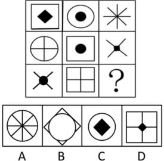

######  【例 2】

从所给的四个选项中，选择最合适的一个填入问号处，使之呈现一
 定的规律性：

解析：九宫格中圆形、黑色圆点、不同轮廓（矩形、三角形等）出现固定次数，遍历后答案为**B**。

#### 二、叠加
- **常见类型**：
   1. **去同存异/去异存同**：
      - 去同存异：两个图形叠加，去掉相同部分，保留不同部分（如“B+8=8”的示例，去掉相同的“8”的部分，保留差异）。
      - 去异存同：两个图形叠加，去掉不同部分，保留相同部分。
   2. **存同存异（纵向/米字看）**：结合图形排列（如九宫格的纵向、米字方向），分析相同和不同部分的保留规律。
   3. **黑白叠加**：明确“黑+黑、白+白、黑+白、白+黑”的叠加规则，根据规则推导图形。
   4. **叠加+旋转/翻转**：叠加后结合旋转或翻转进一步变化，需同时考虑叠加和位置变换。

通过“相似图形看样式”的思路，优先判断遍历，再分析叠加的具体类型（去同存异、黑白叠加等），即可快速匹配规律解题。

##### 真题解析
###### 【例1】

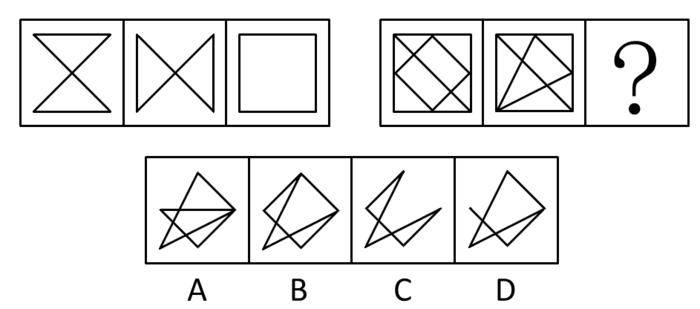

###### 【例2】

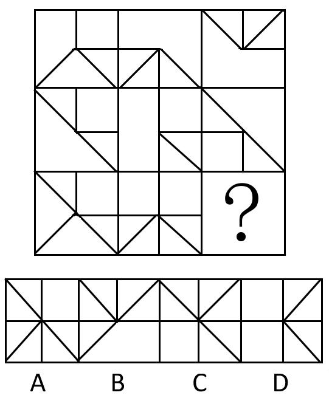

###### 【例3】

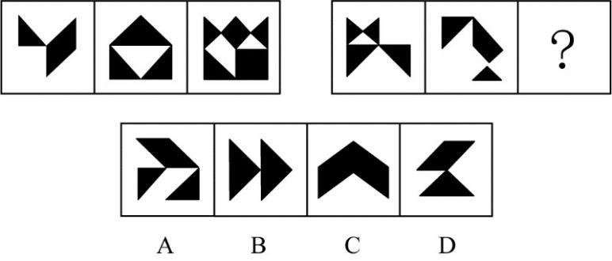

###### 【例4】

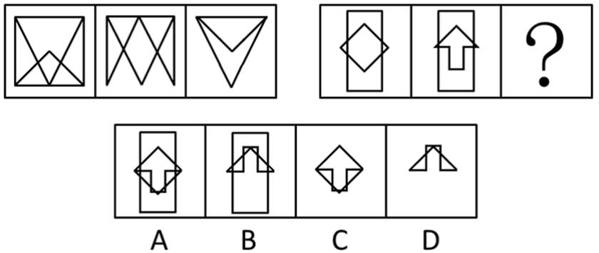

###### 【例5】

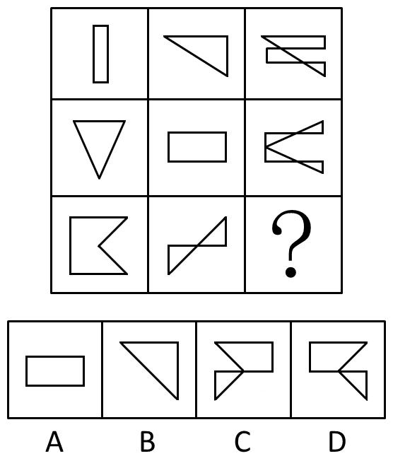

###### 【例6】

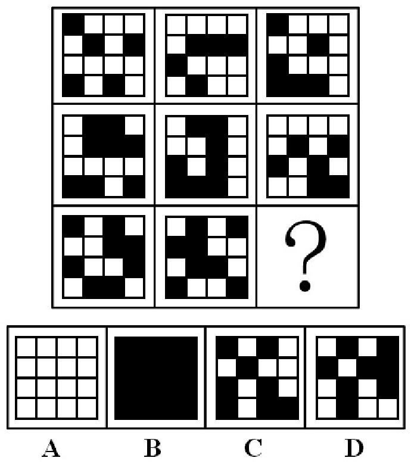

#### 三、解题步骤
1. **识别特征**：图形“相似”，存在线条重合/不重合的叠加特征。
2. **分析叠加**：判断是“去同存异”还是“去异存同”。
3. **结合位置**：观察叠加后是否需要旋转（如90°、180°）或翻转（上下、左右）。
4. **匹配选项**：根据推导的规律，逐一排除不符合的选项。

此类题型的关键是**同时关注叠加规则和位置变换**，通过多组真题的规律总结，可快速识别“叠加+旋转/翻转”的复合考法。

### 属性规律（对称、开闭、曲直性）

#### 一、对称性
- **分类**：
   - 轴对称 vs 中心对称：轴对称图形沿某条直线折叠后两边重合（如“ABC”）；中心对称图形旋转180°后与原图重合（如“NSZ”）。
   - 轴+中心对称 vs 仅轴对称 vs 仅中心对称：部分图形同时具备轴对称和中心对称属性（如“H、口、中”）。
- **细化考法**：对称轴的**数量**（如1条、多条）和**方向**（如水平、垂直、倾斜）。

#### 二、开闭性
- **分类**：
   - 开放 vs 封闭：开放图形线条不闭合，封闭图形线条完全闭合。
   - 半封闭 vs 全封闭：半封闭图形有部分开放区域，全封闭图形无开放区域。

#### 三、曲直性
- **分类**：
   - 曲线图形：由曲线构成。
   - 直线图形：由直线构成。
   - 曲直图形：同时包含曲线和直线。

#### 四、规律应用
**属性规律的核心逻辑**：当图形“凌乱”（无明显位置、样式规律）时，优先考虑属性规律（对称、开闭、曲直性），结合分类、细化考法（如对称轴数量/方向）快速解题。

### 第四节 属性规律（对称、开闭、曲直性）深化

#### 一、对称性细化考法
##### （一）对称轴数量与方向
- 对称轴数量：从1条到多条（如例2中图形对称轴数量依次为1、2、3，最终选**C**）。
- 对称轴方向：涉及水平、垂直、倾斜（如45°），还可结合旋转规律（如例3中对称轴呈45°旋转，答案为**C**）。

##### （二）对称类型分类
- 轴对称 vs 中心对称：可用于图形分组（如例4中“中国、古巴、巴勒斯坦”为一类，“瑞士、老挝、贝宁”为一类，答案**C**）。

#### 二、开闭性考法
- 开放图形 vs 封闭图形：图形“凌乱”时可优先判断（如例5中题干为开放图形，选项中只有**A**是开放图形）。

#### 三、曲直性考法
- 曲线图形、直线图形、曲直图形：结合其他规律（如分组、递推）考查。

#### 四、真题规律应用
解题逻辑：当图形“无明显位置、样式规律”且“形态凌乱”时，优先从**对称、开闭、曲直性**切入，结合细化考法（如对称轴数量/方向、开放封闭分类）快速破题。

### 曲直性规律总结

曲直性是属性规律的重要考点，可单独考查或结合其他规律（如分组、九宫格递推）命题。

- **分类**：
   - 直线图形：由直线构成（如正方形、三角形）。
   - 曲线图形：由曲线构成（如圆形、笑脸）。
   - 曲直图形：同时包含直线和曲线（如圆柱、带曲线的多边形）。

- **真题示例（例7）**：
  九宫格中，第一行均为**直线图形**，第二行均为**曲线图形**，第三行需为**曲直图形**。选项中只有A（圆柱）是曲直图形，故答案为**A**。

- **解题逻辑**：当图形“形态差异大但线条特征明显”时，优先分析曲直性，结合行、列规律快速匹配选项。

##### 真题解析

###### 【例1】

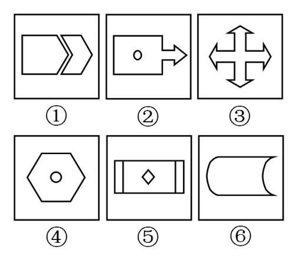

###### 【例2】

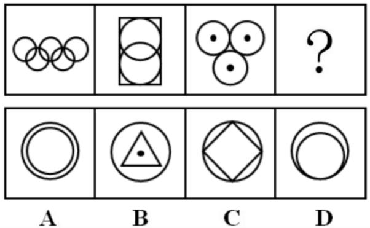

###### 【例3】

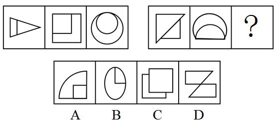

###### 【例4】

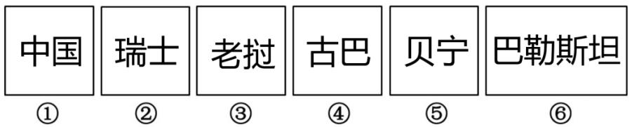

###### 【例5】

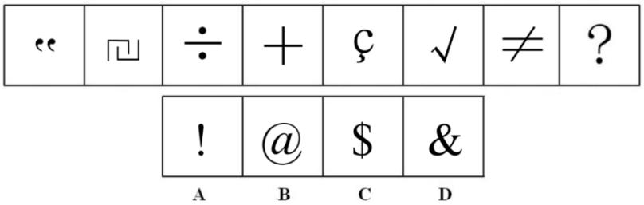

###### 【例6】

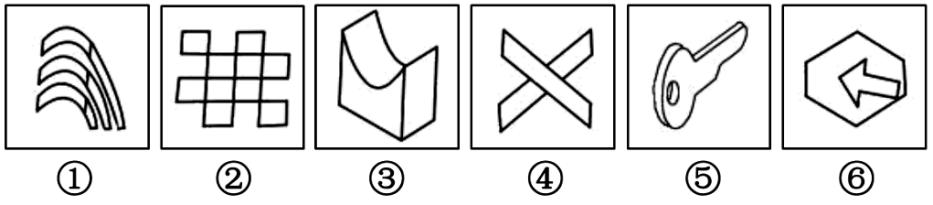

###### 【例7】

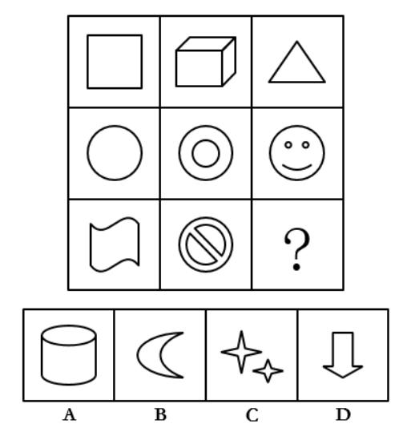

### 第五节 数量规律

#### 一、规律辨识特征
当图形**形状凌乱（不同且不相似）**，且**属性规律（对称、开闭、曲直性）不成立**时，优先考虑**数量规律**。

#### 二、考点1：线的数量规律
##### （一）常规线
1. **直线、曲线数**：分别统计图形中直线和曲线的数量，寻找规律（如递增、递减、相等）。
2. **笔画数**：
   - 笔画数公式：\(\text{笔画数} = \frac{\text{奇点数}}{2}\)（奇点数为0时，笔画数为1）。
   - 奇点：从该点出发的线条数为奇数的点。
   - 分离图形：各部分笔画数相加。

##### （二）特殊线
1. **对称轴的线**：与图形对称性结合，统计对称轴的数量或特征。
2. **细化考法**：
   - 平行线数：统计图形中平行线的组数。
   - 平行线的对数：分析平行线的配对规律。

#### 三、例题解析
##### 例1

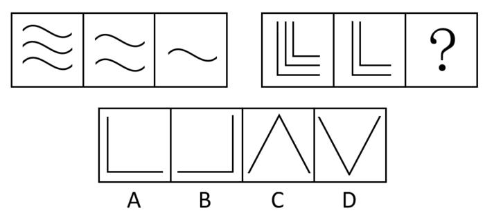

##### 例2

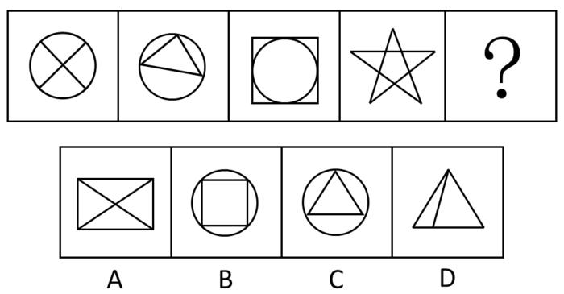

##### 例3

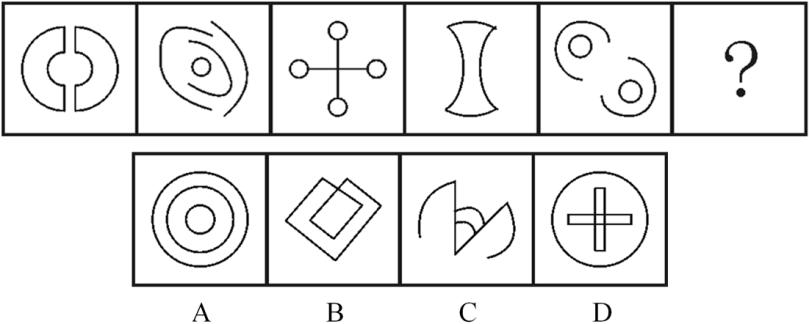

##### 例4

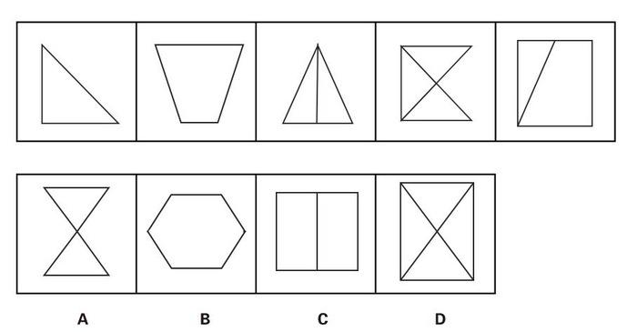

##### 例5

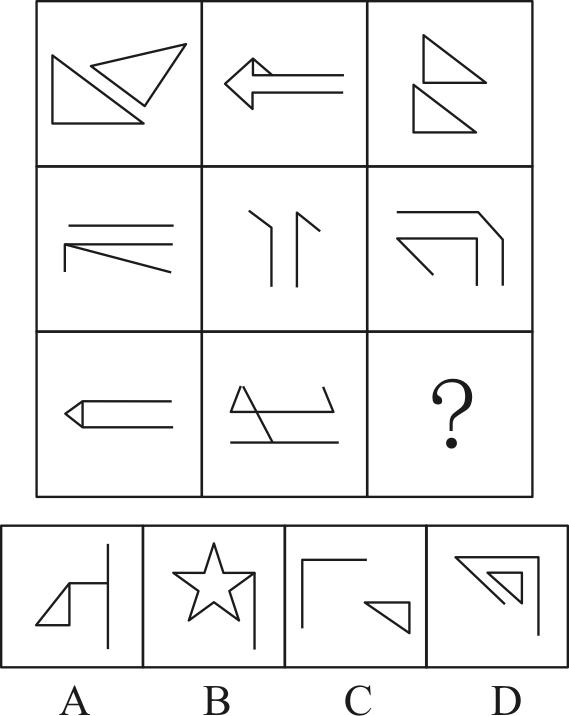

##### 例6

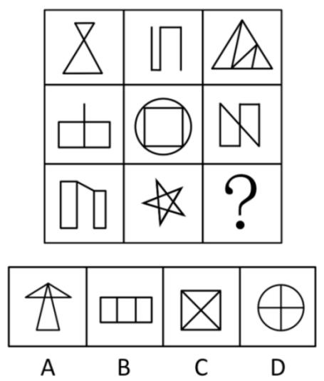

##### 例7（特殊面：曲线构成的面）

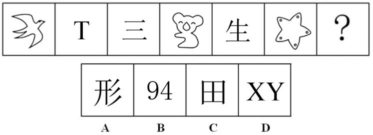

#### 考点 2：面

##### （一）面的定义
面是指**封闭的空白区域**，需注意与“线条”“点”的区分，仅统计封闭且空白的区域。

##### （二）常规考法
1. **面的数量**：直接统计图形中面的个数，寻找递增、递减、相等或周期等规律。
2. **特殊面的考法**：
   - 曲面与直线面：区分由曲线围成的面和由直线围成的面的数量。
   - 相同面的数量：统计图形中形状相同的面的个数。

##### 二、例题解析
###### 例1（面的数量递减）

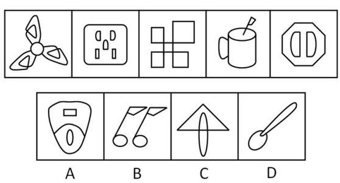

###### 例2（汉字面的数量分组）

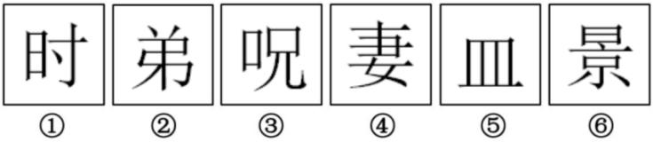

###### 例3（面的数量递增）

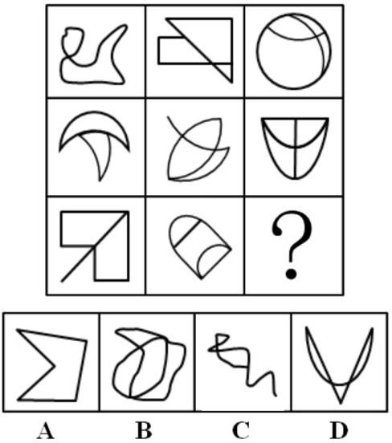

###### 例4

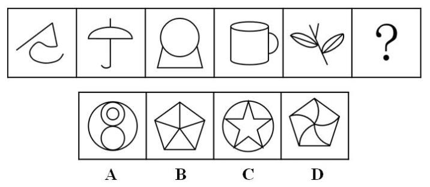

#### 考点 3：点

##### 一、知识点总结
##### （一）点的分类
1. **常规点**：线条相交形成的**交点**（含十字交叉、T型交叉等）。
2. **特殊点**：
   - 端点：线条的起始或终止点（一般不单独考，需结合其他规律）。
   - 切点、顶点、色点（如红点标记的点）。

##### （二）考法
1. **交点总数**：直接统计图形中所有交点的数量，寻找递增、递减或等比/等差规律。
2. **特殊交点**：
   - 内部/外部交点：区分图形内部和外部的交点数量。
   - 标记点（如红点）：关注题干中特殊标记的点的数量或规律。

##### 二、例题解析
###### 例1

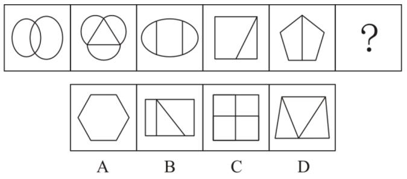

###### 例2

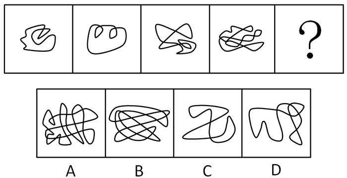

###### 例3

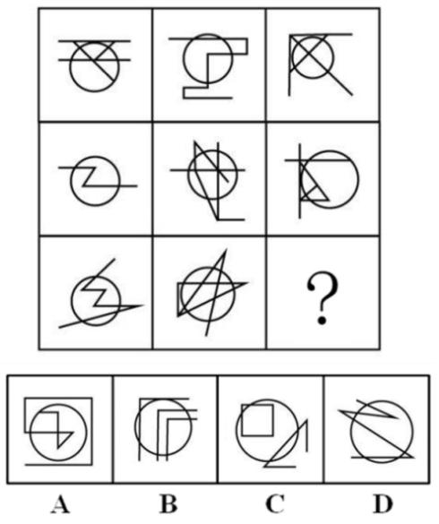

#### 考点 4：角

##### 一、知识点总结
###### （一）角的定义
角是由两条有公共端点的射线组成的几何图形，在图形推理中主要考查**小于180°的角**（包括锐角、直角、钝角）。

###### （二）考法
1. **常规考法**：统计图形中角的**总数**，寻找递增、递减或等差/等比规律。
2. **特殊考法**：
   - 内部/外部角：区分图形内部和外部的角的数量。
   - 直角、锐角、钝角：单独统计某一类特殊角的数量。

##### 二、例题解析
###### 例1

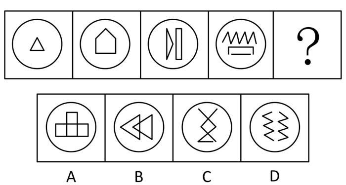

###### 例2

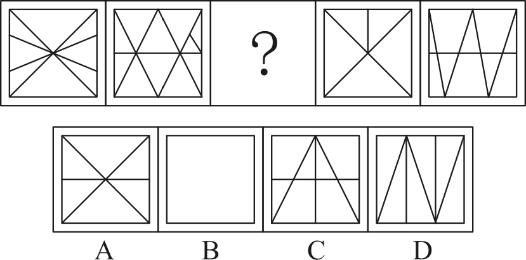

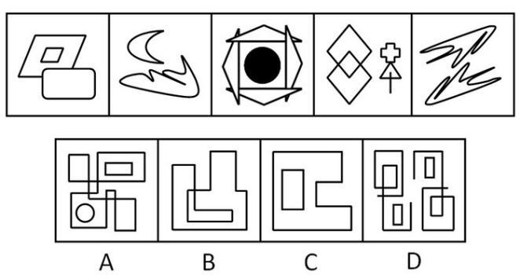

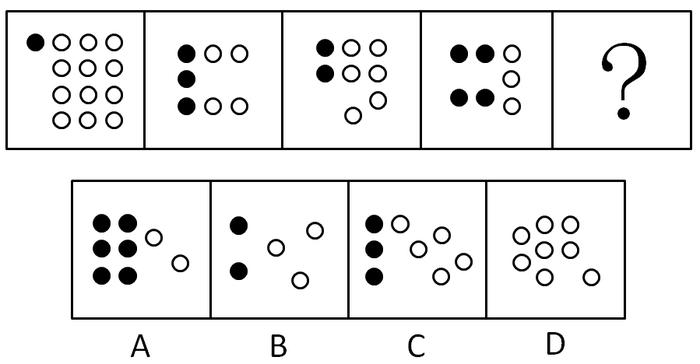

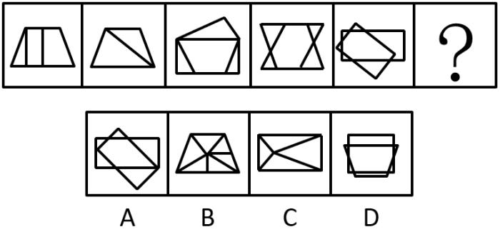

